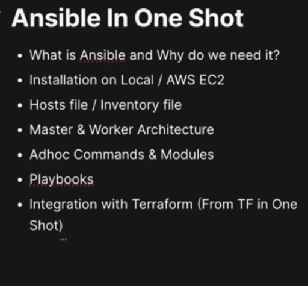
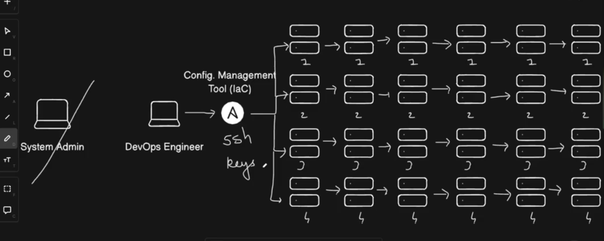
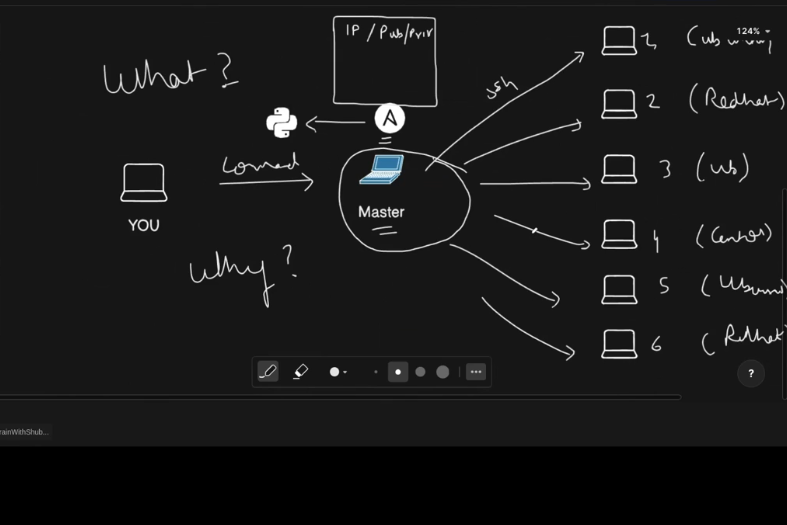
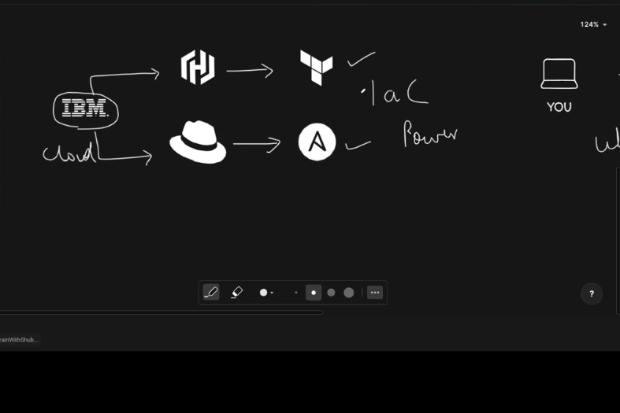
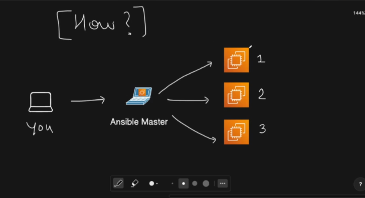
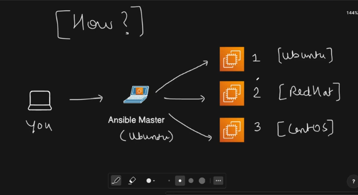
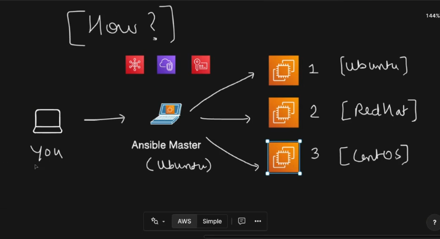
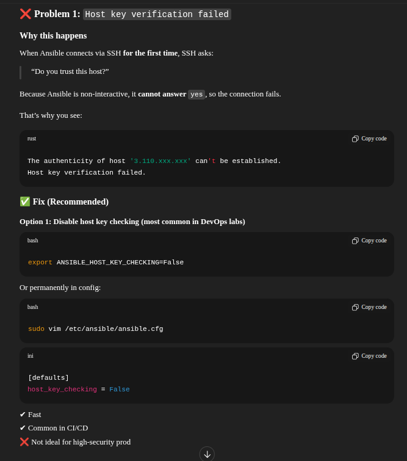
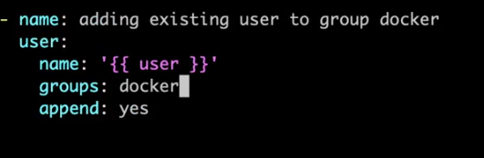

## Ansible In One Shot









---

# 🔧 What is Ansible?

**Ansible** is an **agentless configuration management, automation, and orchestration tool** used to:

- Configure servers (install packages, manage files, users, services)
- Automate repetitive IT tasks
- Orchestrate complex workflows (multi-tier deployments, rolling updates)
- Manage infrastructure at scale

👉 It follows **Infrastructure as Code (IaC)** principles.

### Simple definition:

> _Ansible lets you describe the desired state of your systems in YAML, and it makes reality match that state._

---

# 🧠 Why Ansible Exists (The Problem It Solves)

Before tools like Ansible:

- Manual SSH into servers ❌
- Bash scripts that break easily ❌
- Snowflake servers (no consistency) ❌
- Hard to scale ❌

Ansible solves:

- **Consistency** → same config everywhere
- **Idempotency** → safe to run multiple times
- **Scalability** → manage thousands of nodes
- **Human-readable automation** → YAML

---

# ⭐ Key Features of Ansible

| Feature     | Explanation                        |
| ----------- | ---------------------------------- |
| Agentless   | No agent needed on target machines |
| Uses SSH    | Works out of the box               |
| Idempotent  | Safe re-runs                       |
| Declarative | Define _what_, not _how_           |
| YAML-based  | Easy to read & write               |
| Modular     | Thousands of built-in modules      |
| Push-based  | Control node pushes configs        |

---

# 🏗️ Ansible Architecture (Very Important)


### 1️⃣ Control Node

- Machine where Ansible is installed
- Runs playbooks
- Python required

### 2️⃣ Managed Nodes

- Target machines
- Only requirement: **Python + SSH**
- No Ansible agent needed

### 3️⃣ Inventory

- List of managed nodes
- Can be static or dynamic

### 4️⃣ Modules

- Units of work (yum, apt, copy, service, user, file, etc.)

### 5️⃣ Playbooks

- YAML files describing tasks to execute

---

# 📦 Inventory (Static & Dynamic)

### Static Inventory

```ini
[web]
10.0.0.1
10.0.0.2

[db]
10.0.0.3
```

### Inventory with Variables

```ini
[web]
server1 ansible_host=10.0.0.1 ansible_user=ubuntu
```

### Dynamic Inventory

Used in **cloud environments** (AWS, Azure, GCP):

- Auto-fetch instances using APIs
- Example: EC2 dynamic inventory plugin

---

# 📜 Playbooks (Heart of Ansible)

A **playbook** = one or more **plays**
Each **play**:

- Targets hosts
- Executes tasks

### Example Playbook

```yaml
- name: Configure web server
  hosts: web
  become: yes

  tasks:
    - name: Install nginx
      apt:
        name: nginx
        state: present

    - name: Start nginx
      service:
        name: nginx
        state: started
        enabled: yes
```

---

# 🔄 Idempotency (VERY IMPORTANT)

Idempotency means:

> Running the same playbook multiple times gives the **same result**.

Example:

- Package already installed → no change
- Service already running → no restart

This is **huge** for reliability.

---

# 🔌 Ansible Modules (Deep Dive)

Modules are **pre-written scripts** that do actual work.

### Common Modules

| Category   | Examples             |
| ---------- | -------------------- |
| Package    | apt, yum, dnf        |
| Files      | copy, template, file |
| Services   | service, systemd     |
| Users      | user, group          |
| Networking | nmcli                |
| Cloud      | ec2, s3, iam         |
| Containers | docker_container     |
| K8s        | kubernetes.core.k8s  |

### Example: Copy File

```yaml
- name: Copy config
  copy:
    src: app.conf
    dest: /etc/app.conf
    owner: root
    mode: "0644"
```

---

# 🧩 Roles (Production-Grade Ansible)

Roles help **structure large projects**.

### Role Structure

```text
roles/
 └── nginx/
     ├── tasks/main.yml
     ├── handlers/main.yml
     ├── templates/
     ├── files/
     ├── vars/main.yml
     ├── defaults/main.yml
```

### Use Role in Playbook

```yaml
- hosts: web
  roles:
    - nginx
```

---

# 🔔 Handlers (Event-Driven Tasks)

Handlers run **only when notified**.

```yaml
tasks:
  - name: Update nginx config
    template:
      src: nginx.conf.j2
      dest: /etc/nginx/nginx.conf
    notify: restart nginx

handlers:
  - name: restart nginx
    service:
      name: nginx
      state: restarted
```

---

# 🔐 Variables & Facts

### Variables

```yaml
nginx_port: 80
```

### Facts (Auto Collected)

```yaml
ansible_os_family
ansible_hostname
ansible_ip_addresses
```

Used like:

```yaml
when: ansible_os_family == "Debian"
```

---

# 🧠 Conditionals & Loops

### Condition

```yaml
when: ansible_facts['os_family'] == 'RedHat'
```

### Loop

```yaml
- name: Install packages
  apt:
    name: "{{ item }}"
    state: present
  loop:
    - git
    - curl
    - wget
```

---

# 🔒 Ansible Vault (Secrets Management)

Encrypt sensitive data:

```bash
ansible-vault encrypt secrets.yml
```

Use in playbook:

```yaml
vars_files:
  - secrets.yml
```

---

# 🚀 Ansible vs Terraform (Interview Gold)

| Ansible                  | Terraform                   |
| ------------------------ | --------------------------- |
| Config management        | Infrastructure provisioning |
| Procedural + declarative | Declarative                 |
| SSH-based                | API-based                   |
| Mutable infra            | Immutable infra             |
| Best for OS/app          | Best for cloud resources    |

👉 **Real world:**
Terraform → create infra
Ansible → configure infra

---

# ⚠️ Common Ansible Mistakes

❌ Using `shell` instead of modules
❌ No roles → messy playbooks
❌ Hardcoding values
❌ No idempotency
❌ No vault for secrets

---

# 🧪 Real-World Use Cases

- Server hardening
- App deployments
- Zero-downtime rolling updates
- Kubernetes node setup
- CI/CD automation
- Multi-cloud config

---

# 🎯 How Ansible Fits Your Profile

Given your hands-on with:

- **Docker**
- **Kubernetes**
- **Terraform**
- **Linux scripting**

👉 Ansible becomes your **configuration + orchestration glue**
Perfect for **DevOps SDE-1 / Platform roles**.

---

# 🔥 Interview Questions (with Quick Answers)

**Q: Why is Ansible agentless?**
A: Uses SSH & Python, reducing overhead.

**Q: What is idempotency?**
A: Same result on multiple runs.

**Q: Playbook vs Role?**
A: Playbook = workflow, Role = reusable component.

**Q: When to use Ansible vs Shell scripts?**
A: Ansible for scalable, repeatable automation.

---

# How?



1. Setup 3-nodes using terraform
2. ssh-keygen -> to generate private and public key-pair to be used for the nodes.
3. public-key goes to the ec2-nodes.





4. using ssh, login to the master node.

```
ssh -i terra-key-ec2-ansible ubuntu@ec2-13-235-75-89.ap-south-1.compute.amazonaws.com

```

5. It is not mandatory that the private key should end with .pem.

# On Master Node

# Installing Ansible on Ubuntu (Official Site)

- Ubuntu provides Ansible packages through a Personal Package Archive (PPA) that contains more recent versions than the standard repositories.

- Ubuntu builds are available in a PPA here.

- Configure the PPA on your system and install Ansible:

```
1. sudo apt update
2.  sudo apt install software-properties-common
3. sudo add-apt-repository --yes --update ppa:ansible/ansible
4. sudo apt install ansible
5. ansible --version

6. executable location = /usr/bin/ansible
7.  config file = /etc/ansible/ansible.cfg

8. host file = /etc/ansible/host
```

6. Ansible Master has a host file in which information of all the nodes (private ip, Private key, user to login as)

7. [group of ip addresses]

8. vim hosts -> adding named group -> group of nodes in master
9. Use <public ip-address> for the workers.
10. sudo chmod 666 hosts

```

[ad_servers]
server1  ansible_host=3.110.45.7
server2  ansible_host=65.2.83.228
server3  ansible_host=3.110.175.87

server1 ansible_user=ubuntu # ssh connect dns-info
server2 ansible_user=ec2-user
server3 ansible_user=ec2-user


# common variables -> can't use hyphens in name

[ad_servers:vars]
ansible_python_interpreter=usr/bin/python3 #ansible -v
ansible_ssh_private_key_file=/home/ubuntu/keys/private_access_key.pem

```

11. copy the private-key to master so, that master can access the workers that have public-key by default using terraform.

12. ansible-inventory --list

```
{
    "_meta": {
        "hostvars": {
            "server1": {
                "ansible_host": "3.110.45.7",
                "ansible_python_interpreter": "usr/bin/python3 #ansible -v",
                "ansible_ssh_private_key_file": "/home/ubuntu/keys/private_access_key.pem",
                "ansible_user": "ubuntu"
            },
            "server2": {
                "ansible_host": "65.2.83.228",
                "ansible_python_interpreter": "usr/bin/python3 #ansible -v",
                "ansible_ssh_private_key_file": "/home/ubuntu/keys/private_access_key.pem",
                "ansible_user": "ec2-user"
            },
            "server3": {
                "ansible_host": "3.110.175.87",
                "ansible_python_interpreter": "usr/bin/python3 #ansible -v",
                "ansible_ssh_private_key_file": "/home/ubuntu/keys/private_access_key.pem",
                "ansible_user": "ec2-user"
            }
        }
    },
    "ad_servers": {
        "hosts": [
            "server1",
            "server2",
            "server3"
        ]
    },
    "all": {
        "children": [
            "ungrouped",
            "ad_servers"
        ]
    }
}

```

Here’s a **clear + brief** explanation 👇

---

## 🖥️ Hosts File (Ansible)

**What it is:**
The **hosts file** is where you list the **target machines (managed nodes)** that Ansible will connect to.

**Purpose:**
👉 Tells Ansible _which servers to manage_

**Example:**

```ini
[web]
10.0.0.1
10.0.0.2

[db]
10.0.0.3
```

**Key points:**

- Can contain **IP / hostname**
- Can have **groups** (web, db, prod, dev)
- Often called `hosts` or `inventory`

---

## 📦 Inventory File (Ansible)

**What it is:**
The **inventory file** is a **broader concept** that includes:

- Hosts
- Groups
- Variables (host/group level)
- Connection details

**Purpose:**
👉 Defines _who to manage_ **and** _how to manage them_

**Example:**

```ini
[web]
web1 ansible_host=10.0.0.1 ansible_user=ubuntu

[db]
db1 ansible_host=10.0.0.3 ansible_user=ubuntu
```

---

## 🔍 Difference in One Table

| Hosts File        | Inventory File             |
| ----------------- | -------------------------- |
| List of machines  | Hosts + groups + variables |
| Simple            | More detailed              |
| Basic targeting   | Full connection config     |
| Part of inventory | Inventory itself           |

👉 **In practice:**
✔ _Hosts file is a type of inventory file_

---

## 🎯 Interview One-Liner

> **Inventory defines the infrastructure; hosts are the machines inside it.**

## Adhoc Commands and Modules

1. ansible ad_servers -m ping -> (sending this module to all hosts inside ad_servers group)

2. First give -> chmod 400 private_access_key
   
3. don't use comments in command line of host file.

4. ansilbe server1 -m ping

5. Running adhoc command to see free RAM: ansible server3 -a "free -h"
6. Free disk space -> ansible ad_servers -a "df -h"

7. updating server -> ansible server1 -a "sudo apt-get update"

8. Installing nginx -> ansible server1 -a "sudo apt-get install nginx -y" -> ubuntu

9. Installing httpd -> ansible server2 -a "sudo dnf install httpd -y" -> Amazon, RedHat

10. Why apache not running? -> ansible server2 -a "sudo systemctl status httpd"
11. Activate -> ansible server2 -a "sudo systemctl start httpd"
12. Same for the server3 as server2.

13. ansible all -m ping -> pinging all servers (grouped and ungrouped also)

14. Since, we saw that we have manually start the apacche server and we did a alot of manual work. So, we use the playbooks.yml to define the configuration that can be applied on all the servers.

## Playbook -> Ansible

1. mkdir playbooks
2. vim install_nginx.yml
3. become : yes -> power of root user to execute the things
4. package is module -> that will run to do something on workers.

```
-
    name: Install Nginx
    hosts: ad_servers
    become: yes

    tasks:
        - name: Install Nginx
          package:
            name: nginx
            state: latest

        - name: Start Nginx
          systemd_service:
            name: nginx
            state: started

        - name: Enable Nginx
          systemd_service:
            name: nginx
            enabled: true

```

5. Run -> ansible-playbook playbook.yml

6. On server2 and server3, port:80 is being used by the httpd -> stop to nginx to run.
7. ansilbe server2 -a "sudo systemctl stop httpd"

# Conditional Plabooks

1. ansible ad_servers -m setup | grep ansible_distribution


2. Above script doesn't work for the RedHat because by default docker is not available.

```

---
- name: Install Docker on all servers
  hosts: ad_servers
  become: yes

  tasks:

    # ================= Ubuntu =================
    - name: Install Docker on Ubuntu
      apt:
        name: docker.io
        state: present
        update_cache: yes
      when: ansible_distribution == "Ubuntu"

    - name: Start Docker on Ubuntu
      systemd:
        name: docker
        enabled: yes
        state: started
      when: ansible_distribution == "Ubuntu"


    # ================= Amazon Linux 2023 =================
    - name: Install Docker on Amazon Linux 2023
      dnf:
        name: docker
        state: present
      when:
        - ansible_distribution == "Amazon"
        - ansible_distribution_major_version == "2023"

    - name: Start Docker on Amazon Linux
      systemd:
        name: docker
        enabled: yes
        state: started
      when: ansible_distribution == "Amazon"


    # ================= RHEL 10 (FORCED DOCKER) =================
    - name: Install dependencies on RHEL
      dnf:
        name:
          - dnf-plugins-core
          - container-selinux
        state: present
      when: ansible_distribution == "RedHat"

    - name: Add Docker CE repo on RHEL
      command: >
        dnf config-manager
        --add-repo
        https://download.docker.com/linux/rhel/docker-ce.repo
      args:
        creates: /etc/yum.repos.d/docker-ce.repo
      when: ansible_distribution == "RedHat"

    - name: Install Docker CE on RHEL
      dnf:
        name:
          - docker-ce
          - docker-ce-cli
          - containerd.io
        state: present
      when: ansible_distribution == "RedHat"

    - name: Disable SELinux (required for Docker on RHEL 10)
      selinux:
        state: disabled
      when: ansible_distribution == "RedHat"

    - name: Configure Docker daemon on RHEL
      copy:
        dest: /etc/docker/daemon.json
        content: |
          {
            "exec-opts": ["native.cgroupdriver=systemd"],
            "storage-driver": "overlay2"
          }
      when: ansible_distribution == "RedHat"

    - name: Enable and start Docker on RHEL
      systemd:
        name: docker
        enabled: yes
      when: ansible_distribution == "RedHat"

    - name: Reboot RHEL node (required)
      reboot:
        reboot_timeout: 600
      when: ansible_distribution == "RedHat"

```

```
ansible ad_servers -a "docker --version" -b

ansible ad_servers -a "systemctl status docker --no-pager" -b

```




- pratice from <ansible-project repo> 

3:05