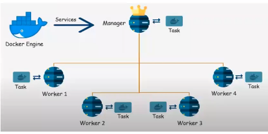

## Docker Mastery

A **hypervisor** is software (or firmware) that **creates and runs virtual machines (VMs)**. It allows **multiple operating systems** to run on a **single physical machine** by sharing hardware resources like CPU, memory, storage, and network.

---

### 🔹 What does a hypervisor do?

* Allocates hardware resources to each VM
* Isolates VMs from each other for security and stability
* Manages VM lifecycle (start, stop, pause)
* Enables efficient hardware utilization

---

### 🔹 Types of Hypervisors

#### **1. Type 1 – Bare-metal Hypervisor**

Runs **directly on the hardware** (no host OS).

**Examples:**

* VMware ESXi
* Microsoft Hyper-V
* Xen
* KVM

✅ High performance
✅ Used in data centers & cloud platforms (AWS, Azure, GCP)

---

#### **2. Type 2 – Hosted Hypervisor**

Runs **on top of an existing operating system**.

**Examples:**

* VirtualBox
* VMware Workstation
* Parallels Desktop

✅ Easy to install
❌ Slightly lower performance
✅ Used for development, testing, learning

---

### 🔹 Simple analogy

Think of a hypervisor as a **building manager**:

* The **physical server** is the building
* **Virtual machines** are apartments
* The **hypervisor** manages who gets how much electricity, water, and space

---

### 🔹 Why hypervisors are important

* Cloud computing foundation
* Server consolidation
* Cost and energy efficiency
* Easy testing & isolation
* Disaster recovery & scalability


In **AWS terms**, a **hypervisor** is the core technology that **AWS uses to virtualize physical servers and run EC2 instances**.

---

## 🔹 Hypervisor in AWS

### **AWS uses a custom hypervisor called *Nitro***

Earlier AWS used **Xen**, but now **most EC2 instances run on the AWS Nitro System**.

---

## 🔹 What is the AWS Nitro Hypervisor?

The **Nitro Hypervisor** is a **lightweight, hardware-assisted hypervisor** that:

* Runs **directly on bare metal (Type 1)**
* Offloads virtualization tasks to **dedicated hardware**
* Leaves more CPU & memory for your EC2 instances

👉 You **don’t manage or see the hypervisor**—AWS manages it for you.

---

## 🔹 How Nitro works (simplified)

```
Physical Server
 ├─ Nitro Card (Networking, Storage, Security)
 ├─ Nitro Hypervisor
 └─ EC2 Instances (Your OS & Apps)
```

* **Nitro Cards** handle:

  * Networking (VPC)
  * EBS storage
  * Security isolation
* **Nitro Hypervisor** focuses only on:

  * CPU & memory isolation

---

## 🔹 Benefits of Nitro in AWS

* 🚀 Near bare-metal performance
* 🔐 Strong isolation between EC2 instances
* 📈 Better scalability
* 🧩 Supports modern instance types (C, M, R, Graviton)

---

## 🔹 EC2 and Hypervisor relationship

* One **physical server**
* Runs **multiple EC2 instances**
* Each EC2 instance = a **virtual machine**
* Hypervisor ensures **resource sharing + isolation**

---

## 🔹 Interview-ready answer

> *In AWS, a hypervisor is the underlying virtualization layer used to run EC2 instances. AWS primarily uses the Nitro Hypervisor, a lightweight Type-1 hypervisor that works with dedicated Nitro hardware to provide secure isolation and near bare-metal performance.*

---

## Part1
1. sudo systemctl start docker
2. sudo systemctl restart docker
3. sudo systemctl status docker

4. docker --version
5. docker --help
6. docker ps -a (to see all containers)
7. docker rm container-id/name -> (to remove the container)
8. docker stop container-id/name -> (to stop running container)
9. docker system prune (to remove stopped container, unused volume and networks)
10. docker logs container-id
11. docker rmi image-id
12. docker attach container-id -> (to see the logs in realtime by attaching your terminal with container terminal)

# Common Commands:
1. run    -     Create and run a new container from an image
3. exec    -    Execute a command in a running container
3. ps      -    List containers
4. build   -    Build an image from a Dockerfile
5. bake    -    Build from a file
6. pull    -    Download an image from a registry
7. push    -    Upload an image to a registry
8. images   -   List images
9. login    -   Authenticate to a registry
10. logout   -   Log out from a registry
11. search    -  Search Docker Hub for images
12. version   -  Show the Docker version information
13. info     -   Display system-wide information


# Add current user to docker group (give it privileges to run docker commands)
1. sudo usermod -a -G docker $USER
2. reboot

# Running mysql:latest image after (docker pull mysql)
1. docker run -it --name my-db - e MYSQL_ROOT_PASSWORD=1234 mysql:latest
2. docker exec -it container-id/name bash (to run the interactive terminal inside the container)
3. mysql -u root -p (to run mysql as root user) -> will prompt to enter the password
4. exit (to exit the terminals of mysql or bash)

# Tags
1. -e = environment
2. -d = daemon (to run the container in background wihtout blocking the terminal)
3. -p system_port:container_port
4. --opt = optional

# Running Jenkins
1. docker pull jenkins/jenkins
2. docker run -d --name jenkins-server -p 8080:8080 jenkins/jenkins:latest
3. In security groups rule, expose the 8080/tcp port for 0.0.0.0/0 IP to access jenkins on any device.

# Running nginx server
1. docker pull nginx
2. docker run -d --name nginx-server -p 80:80 nginx:latest
3. In security groups expose port:80.


# Short method to install docker
1. sudo apt-get update
2. sudo apt-get install docker.io


# Dockerfile
1. Inside one folder there can only one docker file

```
FROM python:3.9
WORKDIR app
COPY . /app
RUN pip install -r requirements.txt 
EXPOSE 8002
CMD ["python","manage.py","runserver","0.0.0.0:8002"]

```
2. docker build . -t my-app (building the image using the dockerfile present in the current directory)
3.  dk run -d -p 8002:8002 my-app:latest


# Dockering a react-django-demo-app
1. git clone repo_url
2. check which python:version does it require and install it
3. sudo apt install python3-pip (package manager to install django further)
4. pip install django==3.2 (install django)
5. django app run on port:8000 by default

--- 

## PART-2
- FROM python:3.9 (pulling the base image of python)
- WORKDIR -> mkdir app && cd app (inside container)
- COPY . . -> copies code from code directly and put in working directory inside the container
- RUN pip install -r requirements.txt -> during image building commands -> (Building stage)
- EXPOSE 8001 -> exposing this port in container to run the app
- CMD ["python", "manage.py", "runserver","0.0.0.0:8001"] -> to start the app after the container starts -> (Running stage)


## Docker Volume (transfer,copy,load,persist)
- In volume, we mount the path inside the conatiner with the path of the system so that data persists even if the container is deleted.
- when we start the container again then, we have same old data persisted inside the system files.
 
1. docker volume create --name django_todo_volume --opt device=/home/ubuntu/projects/volumes/django_todo_volume --opt o=bind --opt type=none
2. docker volume create
3. docker volume ls
4. docker volume inspect
5. docker volume rm
6. docker volume prune

7. docker run -d -p 8001:8001 --mount source=django_todo_volume,target=/app todo-django


## Docker Compose
- If there are multiple container and we have to sync and run all the containers together.
- This allows us to automate the createion/stopping/removal of containers.

1. docker-compose
2. sudo apt install docker-compose (if not installed)
3.  build        – Build or rebuild services
4.  config       – Validate and view the Compose file
5.  create       – Create services
6.  down         – Stop and remove resources -> not the images
7.  events       – Receive real-time events from containers
8.  exec         – Execute a command in a running container
9.  help         – Get help on a command
10. images       – List images
11. kill         – Kill containers
12. logs         – View output from containers
13. pause        – Pause services
14. port         – Print the public port for a port binding
15. ps           – List containers
16. pull         – Pull service images
17. push         – Push service images
18. restart      – Restart services
19. rm           – Remove stopped containers
20. run          – Run a one-off command
21. scale        – Set number of containers for a service
22. start        – Start services
23. stop         – Stop services
24. top          – Display the running processes
25. unpause      – Unpause services
26. up           – Create and start containers
27. version      – Show version information and quit


- vim docker-compose.yaml (to specify the services)

```
version: "3.9"
services:
  web:
    build: .
    ports:
      - "8001:8001"
  db:
    image: mysql:5.7
    ports:
      - "3306:3306"
    environment:
      MYSQL_ROOT_PASSWORD: "1234"
```
- In docker-compose, if we donw the service again and again -> gives WARNING and NOT ERROR. So, this doesn't block the ci/cd pipeline.


## PUSING IMAEGE TO DOCKER HUB
1. docker login (login to docker hub)
2. docker image tag node-todo:latest adarsh5559/node-todo:latest (tagging)
3. docker image push adarsh5559/node-todo:latest (push)

--- 

## Docker swarm

**Docker Swarm** is Docker’s **native container orchestration tool** used to **manage, deploy, and scale containers across multiple machines (nodes)** as a single cluster.

### Simple definition

> **Docker Swarm allows you to run Docker containers on multiple servers, manage them centrally, and ensure high availability and scalability.**

### Key concepts

* **Swarm** → A cluster of Docker nodes
* **Node** → A machine (VM or physical) running Docker
* **Manager Node** → Controls the swarm, schedules tasks, maintains state
* **Worker Node** → Runs the containers assigned by managers
* **Service** → Definition of how containers should run (image, replicas, ports)
* **Task** → A single running container instance

### Core features

* **Clustering** – Combines multiple Docker hosts into one logical system
* **Service orchestration** – Deploy services instead of individual containers
* **Load balancing** – Automatically distributes traffic across containers
* **Scaling** – Scale services up/down with a single command
* **High availability** – Automatically restarts failed containers
* **Secure by default** – Uses TLS for node communication

### Example

```bash
docker swarm init
docker service create --name web --replicas 3 -p 80:80 nginx
```

This runs **3 replicas of Nginx** across available nodes.

### When to use Docker Swarm

* Simple container orchestration needs
* Smaller clusters
* Easier setup compared to Kubernetes
* Teams already using Docker heavily

### Docker Swarm vs Kubernetes (quick)

| Docker Swarm   | Kubernetes           |
| -------------- | -------------------- |
| Easy to set up | Complex but powerful |
| Fewer features | Enterprise-grade     |
| Docker-native  | Cloud-native         |


## docker is not used in production
 1. install docker engine on all the worker nodes.

 - ON MASTER
 1. Go to project 
 2. docker swarm init
 3. docker node ls -> (show swarm nodes)
 4. docker service create --name <service name> --replicas 3 --publish 8001:8001 <image>
 5. docker service ls -> (show running services)
 6. docker service rm <server name>
 7. docker info 
 8. docker swarm --help
 9. docker swarm join-token worker -> (to generate token from manager)
 10. docker swarm leave  -> (to leave the swarm)
 11. docker stack deploy -c <deployment yaml file> <stack name>
 12. docker service scale <service name>=<replicas>
 13. docker service update --image <image> <service name>
 14. docker stack rm
 15. docker service ls
 16. docker service rm


 - docker stack deploy ->  does not help in building the image from the Dockerfile. Image has to be pre-created

 - ON WORKER
 1. docker swarm join --token SWMTKN-1-0ixjemcpwzj50vyhlti531a3grikkln3k64ins4vlshpy9sgbn-7xthipfkvhro3n60z84czychv 172.31.0.186:2377 -> (to join the swarm) -> (on master enable the port 2377)


 - Leader node will create a service to run multiple workers.  

 1. Docker Compose creates -> BRIDGE NETWORK
 2. Docker Swarm creates -> OVERLAY NETWORK


 ---


 ## PART-3

1. lsof -i :8001 -> (It shows what is running on the port 8001)
2. sudo docker kill container-id
3. docker node ls
4. docker swarm leave (if already join in case of error)
5. docker swarm join-token worker (to get tokens for the worker)

- docker container is fragile. If anyone gets the container-id he can kill the container and app will stop. So, we create service using docker swarm which auto heals the container if it stops. So, our app will keep functioning properly.

 

- Tasks is basically running the container in worker node.
- Service defines the Task that needs to be executed on the manager(also run container to utilise resources) and workder node.

- Create 1-master node, 2-worker nodes.
- Install docker on every node.
- On Master node: docker swarm init
- Make the worker node to join the swarm using token. -> (give access to port:2377 on master)

# Task: to run the container on the nodes
1. docker info 
- Create service
2. docker service create --name django-app-service --replicas 3 --publish 8001:8001 adarsh5559/django-todo:latest
3. docker service ls
4. docker service rm service-name

- If you kill the container/task it will not make any effect because manager will auto-heal it using the replicas
- But, if you kill the service on master then, it will stop the apps on all the nodes.
- Only manager can give information of the swarm.
- worker can leave the swarm and the resources allocated will be taken.
- free -h


# Making a deployment with multiple services
1. mkdir deployments
2. vim django-cluster.yaml

- docker stack is a combination of services used in docker swarm.

```
root@ip-172-31-5-28:/home/ubuntu/deployment# cat django-cluster.yaml 
version: '3.7'

services:
  django-app:
    image: adarsh5559/django-todo:latest
    ports:
      - "8001:8001"
  mysql-db:
    image: mysql:latest
    ports:
      - "3306:3306"
    environment:
      MYSQL_ROOT_PASSWORD: "1234"
```

3. docker stack deploy -c django-cluster.yaml django-stack
4. docker service scale <servie-name>=3
5. docker service logs <service-name>
6. docker stack rm <stack-name>

- make changes in app -> update the image -> push it to docker hub -> rollup the change on master
7. docker service update --image <image name> <service name>


Here are the **most important Docker Swarm commands**, grouped logically and **interview + real-world ready** 👇

---

## 🔹 Swarm Initialization & Node Management

### Initialize Swarm

```bash
docker swarm init
```

### Join Swarm (worker / manager)

```bash
docker swarm join --token <token> <manager-ip>:2377
```

### Get join tokens

```bash
docker swarm join-token worker
docker swarm join-token manager
```

### Leave Swarm

```bash
docker swarm leave
docker swarm leave --force
```

### List nodes

```bash
docker node ls
```

### Inspect node

```bash
docker node inspect <node-id>
```

### Promote / Demote node

```bash
docker node promote <node>
docker node demote <node>
```

---

## 🔹 Service Management (MOST IMPORTANT)

### Create service

```bash
docker service create --name web --replicas 3 -p 80:80 nginx
```

### List services

```bash
docker service ls
```

### Inspect service

```bash
docker service inspect <service-name>
```

### View service tasks (containers)

```bash
docker service ps <service-name>
```

### Scale service

```bash
docker service scale web=5
```

### Update service (image/env)

```bash
docker service update --image nginx:latest web
```

### Rollback service

```bash
docker service rollback web
```

### Remove service

```bash
docker service rm <service-name>
```

---

## 🔹 Stack Management (Docker Compose in Swarm)

### Deploy stack

```bash
docker stack deploy -c docker-compose.yml my-stack
```

### List stacks

```bash
docker stack ls
```

### List stack services

```bash
docker stack services my-stack
```

### List stack tasks

```bash
docker stack ps my-stack
```

### Remove stack

```bash
docker stack rm my-stack
```

---

## 🔹 Networking

### List networks

```bash
docker network ls
```

### Create overlay network

```bash
docker network create --driver overlay my-network
```

### Inspect network

```bash
docker network inspect my-network
```

---

## 🔹 Secrets & Configs (Production Feature)

### Create secret

```bash
echo "mypassword" | docker secret create db_password -
```

### List secrets

```bash
docker secret ls
```

### Remove secret

```bash
docker secret rm db_password
```

### Create config

```bash
docker config create app_config config.yml
```

### List configs

```bash
docker config ls
```

---

## 🔹 Logs & Debugging

### Service logs

```bash
docker service logs web
```

### Follow logs

```bash
docker service logs -f web
```

### Container logs (task level)

```bash
docker logs <container-id>
```

---

## 🔹 Cluster Info & Maintenance

### Swarm info

```bash
docker info
```

### Drain node (for maintenance)

```bash
docker node update --availability drain <node>
```

### Activate node

```bash
docker node update --availability active <node>
```


-
---

## PART-4
- docker stop 92 (using the initial of container-id)
This is was Q/A session only!


## What is `nohup`?

`nohup` stands for **“no hang up”**.
It is a Linux/Unix command used to **run a process in the background so it continues running even after you log out or close the terminal**.

Normally, when you close a terminal, all running processes receive a **SIGHUP (hangup signal)** and stop.
`nohup` **prevents this signal**, keeping the process alive.

---

## Why is `nohup` useful?

* Run **long-running jobs** (servers, scripts, builds)
* Keep apps running on **remote servers (EC2, VPS)** after SSH disconnect
* Avoid using screen/tmux for simple background tasks
* Capture logs automatically

Common use cases:

* Starting a backend server
* Running data processing scripts
* Training ML models
* Running cron-like scripts manually

---

## Basic Syntax

```bash
nohup command [arguments] &
```

* `nohup` → ignore hangup signal
* `&` → run in background

---

## Simple Example

```bash
nohup sleep 300 &
```

* Runs `sleep` for 5 minutes
* Continues even if you log out

Output:

```text
[1] 12345
```

(12345 is the process ID)

---

## Example: Run a Python Script

```bash
nohup python app.py &
```

* Script keeps running after logout
* Output is saved to **`nohup.out`**

Check logs:

```bash
cat nohup.out
```

---

## Example: Django / Flask Server

```bash
nohup python manage.py runserver 0.0.0.0:8000 &
```

or

```bash
nohup flask run --host=0.0.0.0 --port=5000 &
```

---

## Redirect Output (Recommended)

By default, output goes to `nohup.out`.
You can control it:

```bash
nohup python app.py > app.log 2>&1 &
```

Explanation:

* `>` → stdout to `app.log`
* `2>&1` → stderr to same file
* `&` → background

---

## Check Running `nohup` Process

```bash
ps aux | grep app.py
```

or using PID:

```bash
ps -p 12345
```

---

## Stop a `nohup` Process

```bash
kill 12345
```

Force kill (if needed):

```bash
kill -9 12345
```

---

## Difference: `nohup` vs `&`

| Feature            | `command &` | `nohup command &` |
| ------------------ | ----------- | ----------------- |
| Runs in background | ✅           | ✅                 |
| Survives logout    | ❌           | ✅                 |
| Handles SIGHUP     | ❌           | ✅                 |
| Auto log file      | ❌           | ✅ (`nohup.out`)   |

---

## When NOT to Use `nohup`

* When you need session management → use `tmux` or `screen`
* When you want automatic restarts → use `systemd`, `supervisor`, or Docker

---

## Quick Tip (Very Common)

On servers, this is the **most used pattern**:

```bash
nohup command > output.log 2>&1 &
```

---


## What is a Multi-Stage Dockerfile?

A **multi-stage Dockerfile** allows you to use **multiple `FROM` statements** in a single Dockerfile.
Each `FROM` starts a **new build stage**.

👉 The key idea:
**Use one stage to build/compile the application and another stage to run it**, copying only what is needed into the final image.

This results in:

* ✅ Smaller image size
* ✅ Better security (no build tools in runtime)
* ✅ Cleaner, production-ready images

---

## Problem Without Multi-Stage Build

Example (Node.js):

```dockerfile
FROM node:18

WORKDIR /app
COPY package*.json ./
RUN npm install
COPY . .
RUN npm run build

EXPOSE 3000
CMD ["npm", "start"]
```

### Issues:

* Includes **node_modules**, npm cache, build tools
* Image size is large
* Build tools are present in production image

---

## Solution: Multi-Stage Dockerfile

### Basic Structure

```dockerfile
FROM image1 AS stage1
# build stuff

FROM image2 AS stage2
# runtime stuff
```

Each stage is **isolated**.
You selectively copy files using:

```dockerfile
COPY --from=stage1 source destination
```

---

## Example 1: Node.js App (Build + Runtime)

### Multi-Stage Dockerfile

```dockerfile
# ---------- Stage 1: Build ----------
FROM node:18-alpine AS builder

WORKDIR /app

COPY package*.json ./
RUN npm install

COPY . .
RUN npm run build


# ---------- Stage 2: Runtime ----------
FROM node:18-alpine

WORKDIR /app

COPY --from=builder /app/dist ./dist
COPY --from=builder /app/package*.json ./
RUN npm install --only=production

EXPOSE 3000
CMD ["node", "dist/index.js"]
```

### What happens:

1. **Stage 1**

   * Installs all dependencies
   * Builds the app
2. **Stage 2**

   * Copies only built files (`dist`)
   * Installs only production dependencies
   * No build tools included

📉 **Image size reduced significantly**

---

## Example 2: Java (Maven + JAR)

### Without Multi-Stage

Image size ~600MB 😞

### With Multi-Stage

```dockerfile
# ---------- Build Stage ----------
FROM maven:3.9-eclipse-temurin-17 AS builder

WORKDIR /app
COPY pom.xml .
RUN mvn dependency:go-offline

COPY src ./src
RUN mvn package -DskipTests


# ---------- Runtime Stage ----------
FROM eclipse-temurin:17-jre-alpine

WORKDIR /app
COPY --from=builder /app/target/app.jar app.jar

EXPOSE 8080
CMD ["java", "-jar", "app.jar"]
```

### Benefits:

* Maven & source code **not present** in runtime image
* Runtime image ~100MB

---

## Example 3: Python (Build Dependencies Removed)

```dockerfile
# ---------- Build Stage ----------
FROM python:3.11 AS builder

WORKDIR /app
COPY requirements.txt .
RUN pip wheel --no-cache-dir --no-deps -r requirements.txt


# ---------- Runtime Stage ----------
FROM python:3.11-slim

WORKDIR /app
COPY --from=builder /app /app
COPY . .

RUN pip install --no-cache-dir *.whl

CMD ["python", "app.py"]
```

### Why this is useful:

* Removes compilers (`gcc`, `build-essential`)
* Smaller & safer image

---

## Target Specific Stage (Optional)

You can build only a specific stage:

```bash
docker build --target builder -t myapp-builder .
```

Useful for:

* Debugging
* CI pipelines

---

## Naming Stages (Best Practice)

```dockerfile
FROM golang:1.22 AS build
FROM scratch AS runtime
```

✔ Improves readability
✔ Easier maintenance

---

## Common Best Practices

### 1. Use Small Base Images

```dockerfile
node:alpine
python:slim
distroless
scratch
```

### 2. Minimize COPY

Copy only what you need into the final stage.

### 3. Cache Dependencies

Copy dependency files before source code.

```dockerfile
COPY package.json .
RUN npm install
COPY . .
```

---

## Multi-Stage vs Single-Stage

| Feature             | Single Stage | Multi Stage |
| ------------------- | ------------ | ----------- |
| Image size          | Large        | Small       |
| Security            | Lower        | Higher      |
| Build tools in prod | Yes          | No          |
| Maintenance         | Harder       | Cleaner     |

---

## When to Use Multi-Stage Builds?

✅ Always use when:

* You compile code (Java, Go, Node, C++)
* You want production-ready images
* You care about security & size

❌ Not needed for:

* Simple scripts
* One-liner containers

---

## One-Line Summary

> **Multi-stage Dockerfiles separate build and runtime environments, producing smaller, cleaner, and more secure Docker images.**

---


## 1️⃣ Use Smaller Base Images (BIGGEST IMPACT)

### ❌ Bad

```dockerfile
FROM ubuntu:latest
```

### ✅ Better

```dockerfile
FROM node:18-alpine
```

### ✅ Even Better

```dockerfile
FROM node:18-slim
```

### Ultra-minimal (advanced)

```dockerfile
FROM gcr.io/distroless/nodejs18
```

| Base Image  | Approx Size |
| ----------- | ----------- |
| ubuntu      | ~70MB       |
| node        | ~900MB      |
| node:slim   | ~200MB      |
| node:alpine | ~50MB       |
| distroless  | ~20MB       |

---

## 2️⃣ Use Multi-Stage Builds (MOST RECOMMENDED)

Remove build tools from the final image.

```dockerfile
# Build stage
FROM node:18 AS build
WORKDIR /app
COPY package*.json ./
RUN npm install
COPY . .
RUN npm run build

# Runtime stage
FROM node:18-alpine
WORKDIR /app
COPY --from=build /app/dist ./dist
COPY package*.json ./
RUN npm install --only=production

CMD ["node", "dist/index.js"]
```

📉 Size drops **2–5× easily**

---

## 3️⃣ Remove Unnecessary Files (`.dockerignore`)

Docker sends **everything** to build context unless ignored.

### Create `.dockerignore`

```dockerignore
node_modules
.git
.gitignore
Dockerfile
README.md
tests
logs
.env
```

💡 This alone can save **hundreds of MBs**

---

## 4️⃣ Reduce Layers (Combine RUN Commands)

### ❌ Bad

```dockerfile
RUN apt update
RUN apt install -y curl
RUN rm -rf /var/lib/apt/lists/*
```

### ✅ Good

```dockerfile
RUN apt update \
 && apt install -y curl \
 && rm -rf /var/lib/apt/lists/*
```

---

## 5️⃣ Clean Package Manager Cache

### For Debian/Ubuntu

```dockerfile
RUN apt-get update \
 && apt-get install -y python3 \
 && rm -rf /var/lib/apt/lists/*
```

### For Alpine

```dockerfile
RUN apk add --no-cache python3
```

### For npm

```dockerfile
RUN npm install --omit=dev
```

### For pip

```dockerfile
RUN pip install --no-cache-dir -r requirements.txt
```

---

## 6️⃣ Install Only Production Dependencies

### Node.js

```dockerfile
RUN npm install --only=production
```

or

```dockerfile
RUN npm ci --omit=dev
```

### Python

```dockerfile
RUN pip install --no-cache-dir -r requirements.txt
```

---

## 7️⃣ Copy Only Required Files

### ❌ Bad

```dockerfile
COPY . .
```

### ✅ Good

```dockerfile
COPY dist ./dist
COPY package.json .
```

---

## 8️⃣ Use `--chown` While Copying

Avoid extra layers caused by `chown`.

```dockerfile
COPY --chown=node:node . /app
```

---

## 9️⃣ Use `scratch` or `distroless` (Advanced)

### Go Example (Smallest Images)

```dockerfile
# Build
FROM golang:1.22 AS builder
WORKDIR /app
COPY . .
RUN CGO_ENABLED=0 GOOS=linux go build -o app

# Runtime
FROM scratch
COPY --from=builder /app/app /
CMD ["/app"]
```

📦 Image size: **<10MB**

---

## 🔟 Analyze Image Size

### Check layer sizes

```bash
docker history myimage
```

### Dive tool (recommended)

```bash
docker run --rm -it wagoodman/dive myimage
```

---

## 1️⃣1️⃣ Remove Unused Images & Cache

```bash
docker system prune -a
```

⚠️ Removes unused images & containers

---

## Best Practices Checklist ✅

✔ Use alpine / slim
✔ Multi-stage builds
✔ `.dockerignore`
✔ Clean package cache
✔ Production dependencies only
✔ Avoid `COPY . .`
✔ Analyze with `docker history`

---

## Real Example (Before vs After)

| Version                 | Size   |
| ----------------------- | ------ |
| Single-stage Node image | ~1.2GB |
| Multi-stage + alpine    | ~120MB |
| Distroless              | ~40MB  |

---

## TL;DR (Interview Answer)

> **Reduce Docker image size by using small base images, multi-stage builds, cleaning package caches, installing only production dependencies, and excluding unnecessary files with `.dockerignore`.**

---

