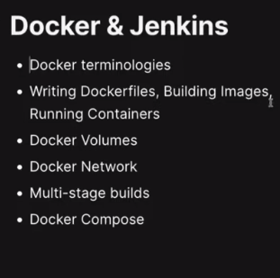
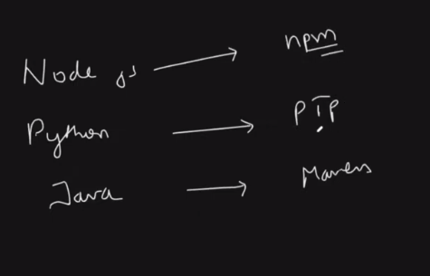
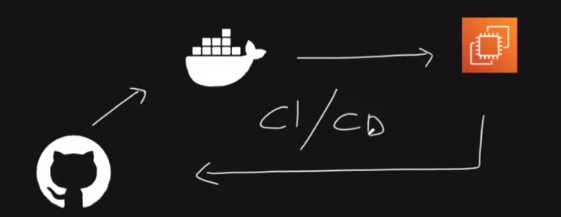
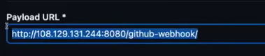

# Docker-Jenkins Project




# Terminolgies

1. Dockerfile -> Docker Image -> Docker Conatainer 

```
2. sudo apt-get update
3. sudo apt-get install docker.io
4. sudo apt-get install docker-compose-v2
5. docker --version
6. sudo systemctl status docker
7. sudo usermod -aG docker $USER
8. sudo newgrp docker
9. docker ps

10. RUN -> is build time command
11. CMD/ENTRYPOINT -> run-time commands -> array of string

```

# Online-shop Dockerfile

```
# Getting the base image
FROM node:18

# Setting the working directory
WORKDIR /app

# copy everything to the container
COPY . .

# Install dependencies
RUN npm install 

# Expose the port the app runs on
EXPOSE 5173

# serve the app
CMD ["npm", "run", "dev"]

```

```
1. docker build -t online_shop:latest .
2. docker images

3. docker run -d -p 5173:5173 online_shop:latest
4. docker ps
5. docker logs <container-id>
6. Edit the inbound traffic for port:5173
7. docker stop <container-id>
8. docker rm <container-id>

```

# Scenario -> I want to persist the logs of the container inside my host machine inside a folder

```
1. mkdir volume
2. cd volume
3. mkdir online_shop
4. docker run -d -p 5173:5173 -v /home/ubuntu/volume/online_shop:/logs --name online_shop_app online_shop:latest
5. docker exec -it 47cc666ea7c5 bash
6. cd /logs
7. echo "this is a log line" > app.log
8. echo "this is also log line" >> app.log
9. exit
10. docker stop 47cc666ea7c5
11. docker rm <container-id>
12. But, logs will be in: cat voloume/online_shop/app.log


```


# Docker Network
1. If container want to communicate with each other then, they need to be in the same newtwork -> bridge network (default).

2. Completely isolated container -> network: none
3. When the container runs on the same network as the host system -> network: host -> jaisa host ka port:80 | waisa container ka port:80 -> no port mapping needed

4. Bridge network -p 5173 ---- -p 5173 
5. user-defined bridge -> docker network create my-net
6. docker run --network -> to give network to container
7. IPVLAN -> when container are running on different host machines.
8. MACVLAN -> same as above but using the mac-address
9. OVERLAY -> in docker swarm cluster

```
1. docker network create my-net
2. docker network ls
3. docker inspect my-net
4. docker run -d --network my-net -p 80:80 --name nginx nginx:latest 

5. docker run -d --network my-net -p 5173:5173 --name online_shop_cnt online_shop:latest

6. Both the containers are in the same network so, they can access each other.

7. docker exec -it 81177e9aa986 bash  ->  <online-shop>
8.  curl http://nginx:80 -> container - IP address


```

## Multi-stage builds

1. No. of base images in the docker file = No. to stages in dockerfile


# Multi-stage Dockerfile
```
# Base image to build NPM packages (stage 1) -> (big-image)

FROM node:18 AS builder

WORKDIR /app

COPY package*.json ./

RUN npm install

COPY . .


# Base image to run the application only (stage 2) -> (small image)

FROM node:18-alpine

WORKDIR /app

COPY --from=builder /app .

EXPOSE 5173

CMD ["npm", "run", "dev"]

```

2. docker build -t online_shop_multi:latest .
3. docker run -d -p 5173:5173 --name online-shop image-name

You probably mean **“distroless image”** (very common DevOps term 👍).
Let’s break it down cleanly.

---

## What is a distroless image?

A **distroless image** is a Docker container image that contains **only your application and its runtime dependencies**, and **no Linux distribution utilities**.

That means **NO**:

* ❌ shell (`/bin/sh`, `bash`)
* ❌ package manager (`apt`, `yum`, `apk`)
* ❌ OS tools (`ls`, `ps`, `curl`, etc.)

Just:

* ✅ your app
* ✅ language runtime (Node, Java, Python, etc.)
* ✅ required libraries

---

## Why is it called “distroless”?

Normal images are based on Linux distros like:

* Ubuntu
* Debian
* Alpine

**Distroless removes the “distro” part** → hence *distro-less*.

---

## Why use distroless images?

### 1️⃣ Smaller image size

Example:

* `node:18` → ~900 MB
* `node:18-alpine` → ~120 MB
* `distroless/nodejs` → ~60 MB

### 2️⃣ Better security 🔐

* Smaller attack surface
* No shell → attackers can’t exec into the container
* Fewer CVEs

### 3️⃣ Faster startup

* Less stuff to load

---

## Common distroless images (by Google)

```text
gcr.io/distroless/base
gcr.io/distroless/nodejs
gcr.io/distroless/java17
gcr.io/distroless/python3
```

---

## Example: Node.js with distroless

### ❌ Normal image

```dockerfile
FROM node:18
CMD ["npm", "run", "start"]
```

### ✅ Distroless (production-grade)

```dockerfile
FROM node:18 AS builder
WORKDIR /app
COPY package*.json ./
RUN npm install
COPY . .
RUN npm run build

FROM gcr.io/distroless/nodejs18
WORKDIR /app
COPY --from=builder /app/dist ./dist
CMD ["dist/index.js"]
```

---

## ⚠️ Important limitations

Distroless images:

* ❌ You **cannot SSH or exec** into them
* ❌ Debugging inside container is hard
* ❌ No shell commands allowed

👉 Best practice:

* Use **normal image** for development
* Use **distroless** for production

---

## When should *you* use distroless?

Perfect for:

* Production Kubernetes workloads
* Microservices
* Security-sensitive environments
* CI/CD final images

Not ideal for:

* Development
* Debug-heavy workloads

---

## Docker Compose
1. A tool to run the container all at once.
2. vim docker-compose.yml

```
services:
    online-shop:
        build:
            context: .
        container_name: online_shop
        ports:
            - "5173:5173"
        networks:
            - my-net

networks:
    my-net:

```

3. docker-compose up -d
4. docker-compose down
5. docker-compose -v
6. docker-compose -h

🧹 Clean EVERYTHING (recommended for a fresh start)
docker system prune -a -f


This removes:

all stopped containers

all unused images

all unused networks

build cache

⚠️ This is destructive — your system will be clean.


## Jenkins-Revision


Alright, let’s do **Jenkins the way it’s actually used in production**, not the tutorial-version 😄
I’ll break this down from **core concepts → real production architecture → pipelines → security → scaling → best practices**, with examples that match **enterprise / DevOps-grade projects**.

---

## 1. What Jenkins Really Is in Production

In production-grade systems, **Jenkins is not just a CI tool**. It acts as:

* **CI/CD Orchestrator**
* **Automation Hub** for builds, tests, security scans, deployments
* **Control plane** that coordinates tools like Docker, Kubernetes, AWS, Terraform, Ansible, SonarQube, etc.

Key idea:

> Jenkins **does not do the work itself** — it **orchestrates** work on distributed agents.

---

## 2. Jenkins Core Architecture (Production View)

### 2.1 Jenkins Components

#### 1. Jenkins Controller (Master)

Responsibilities:

* Manages pipelines
* Stores job configurations
* Maintains build history & logs
* Schedules jobs on agents
* Manages plugins & credentials

⚠️ **In production**:

* Controller **must NOT run builds**
* It should be lightweight and stable

#### 2. Jenkins Agents (Workers)

Responsibilities:

* Execute build steps
* Run tests
* Build Docker images
* Deploy applications

Agents can be:

* Static VMs
* Docker containers
* Kubernetes Pods (most common now)
* Cloud instances (AWS EC2, GCP, Azure)

---

### 2.2 Typical Production Jenkins Architecture

```
GitHub / GitLab
       |
       v
Jenkins Controller (EC2 / EKS)
       |
       |--- Agent 1 (Docker build)
       |--- Agent 2 (Test runner)
       |--- Agent 3 (Terraform)
       |--- Agent 4 (K8s deploy)
```

Modern setup:

```
Jenkins Controller
       |
Kubernetes Cluster
       |
Dynamic Jenkins Agent Pods
```

---

## 3. Jenkins Installation Choices (Production)

### Option 1: VM-based Jenkins

* Jenkins installed on EC2
* Agents on EC2s
* Simple but **hard to scale**

### Option 2: Docker-based Jenkins

* Jenkins controller in Docker
* Agents also Docker-based
* Better isolation

### ✅ Option 3: Jenkins on Kubernetes (Best Practice)

* Jenkins controller runs as a pod
* Agents are **ephemeral pods**
* Auto-scale agents
* Clean builds (no leftover state)

This is what **FAANG-level pipelines** use.

---

## 4. Jenkins Pipelines (Production Standard)

### 4.1 Why Declarative Pipelines Only

Production projects **must use Jenkinsfile** (Pipeline as Code).

Benefits:

* Version controlled
* Reproducible
* Auditable
* Easier rollback

---

### 4.2 Declarative Pipeline Structure

```groovy
pipeline {
  agent any

  environment {
    NODE_ENV = 'production'
  }

  stages {
    stage('Checkout') {
      steps {
        git branch: 'main', url: 'https://github.com/org/app.git'
      }
    }

    stage('Build') {
      steps {
        sh 'npm install'
        sh 'npm run build'
      }
    }

    stage('Test') {
      steps {
        sh 'npm test'
      }
    }

    stage('Docker Build') {
      steps {
        sh 'docker build -t app:${BUILD_NUMBER} .'
      }
    }

    stage('Deploy') {
      steps {
        sh 'kubectl apply -f k8s/'
      }
    }
  }
}
```

---

## 5. Jenkins + Git (Production Flow)

### Branch Strategy Integration

| Branch    | Jenkins Job          |
| --------- | -------------------- |
| feature/* | Build + Test         |
| develop   | Build + Test + Scan  |
| main      | Full CI/CD           |
| release   | Versioned deployment |

Use:

* **Multibranch Pipelines**
* Auto-detect Jenkinsfile per branch

---

## 6. Jenkins Credentials Management (Critical)

### Never Hardcode Secrets ❌

Production Jenkins uses:

* Jenkins Credentials Store
* AWS Secrets Manager
* HashiCorp Vault
* Kubernetes Secrets

Example:

```groovy
withCredentials([string(credentialsId: 'docker-pass', variable: 'DOCKER_PASS')]) {
  sh 'docker login -u admin -p $DOCKER_PASS'
}
```

---

## 7. Jenkins Security (Production MUST)

### 7.1 Authentication

* LDAP / Active Directory
* GitHub OAuth / GitLab OAuth
* SSO (SAML)

### 7.2 Authorization

Use **Role-Based Access Control (RBAC)**

Roles:

* Admin
* Developer
* QA
* Release Manager

### 7.3 Network Security

* Jenkins behind **Nginx / ALB**
* HTTPS only
* Firewall rules
* No public agent access

---

## 8. Jenkins Plugin Strategy (Very Important)

❌ Common mistake:

> Installing 50+ plugins blindly

✅ Production rule:

* Minimal plugins
* Only actively maintained plugins

Core production plugins:

* Pipeline
* Git
* Credentials Binding
* Kubernetes
* Docker Pipeline
* Blue Ocean (optional UI)

---

## 9. Jenkins + Docker (Production Pattern)

### Why Docker in Jenkins?

* Reproducible builds
* Consistent environments
* Isolation

Example:

```groovy
agent {
  docker {
    image 'node:18'
  }
}
```

---

## 10. Jenkins + Kubernetes (Enterprise Setup)

### Dynamic Agents with Kubernetes Plugin

```groovy
agent {
  kubernetes {
    yaml """
apiVersion: v1
kind: Pod
spec:
  containers:
  - name: node
    image: node:18
    command:
    - cat
    tty: true
"""
  }
}
```

Benefits:

* Auto-scale agents
* Zero idle cost
* Clean environments

---

## 11. Jenkins + Infrastructure as Code

### Jenkins + Terraform

Pipeline stages:

1. `terraform init`
2. `terraform plan`
3. Manual approval
4. `terraform apply`

```groovy
stage('Terraform Apply') {
  input "Apply changes?"
  steps {
    sh 'terraform apply -auto-approve'
  }
}
```

---

## 12. Jenkins + Monitoring & Logging

### Metrics

* Jenkins Prometheus Plugin
* Node metrics
* Build duration
* Queue time

### Logs

* Centralized via ELK / Loki
* Jenkins logs shipped to CloudWatch / Grafana

---

## 13. High Availability Jenkins (Production)

### Problem:

* Jenkins controller is **stateful**

### Solutions:

* Daily backups of:

  * `JENKINS_HOME`
* External storage (EBS / EFS)
* Standby controller
* Infrastructure recreated via Terraform

Jenkins **scales horizontally via agents**, not controllers.

---

## 14. Production CI/CD Flow Example (MERN / Microservices)

1. Code pushed to GitHub
2. Jenkins triggered (Webhook)
3. Lint + Test
4. Security scan (Snyk / Trivy)
5. Docker image build
6. Push to AWS ECR
7. Deploy to AWS EKS
8. Smoke tests
9. Slack / Email notification

---

## 15. Common Production Anti-Patterns ❌

* Running builds on controller
* Hardcoding credentials
* Manual deployments
* No rollback strategy
* Too many plugins
* No backup of Jenkins home

---

## 16. Why Jenkins Is Still Used in Enterprises

Despite GitHub Actions, GitLab CI:

* Highly customizable
* Tool-agnostic
* Mature ecosystem
* Works with legacy systems
* Full control over infra

---

## 17. Interview-Ready One-Liner

> “In production, Jenkins acts as a CI/CD orchestrator that coordinates builds, tests, security scans, containerization, infrastructure provisioning, and Kubernetes deployments using pipeline-as-code and distributed agents.”

---


# practice

1. Install Jenkins (dependency: java)
2. sudo systemctl status jenkins
3. expose the port:8080
4. open jenkins public-ip:8080
5. create job  -> pipeline
6. pipeline follow groovy syntax
7.  sudo usermod -aG docker jenkins -> newgrp docker
8. sudo systemctl restart docker
9. sudo systemctl restart jenkins
10. sudo -u jenkins docker ps


# Agent setup
1. sudo apt-get update
2. Install java only
3. Go to master:
    i. cd .ssh
    ii. ssh-keygen
4. Go to agent:
    i. copy the public-key in authorized keys
5. Check if you are able to ssh from master -> agent
6. On Master:
    i. Manage jenkins
    ii. setup agent
    iii. make folder on agent and give path in master
    iv. label -> dev-server
    v. launch via ssh
    vi. agent public-ip on host
    vii. setup Non verifying verification
    viii. check if node is sync

7. install docker.io, docker-compose on agent
8. sudo usermode -aG docker ubuntu
9. newgrp docker

10. sudo systemctl restart jenkins -> on master
11. add pipline stage view pluggin -> restart
```
agent {label "dev-server"}
```

# Auto ci-cd
1. expose port:8080 on master
2. take public-ip master and create webhook on github.
3. payload url -> "public-ip-master"

4. Jenkins -> Triggers -> github hook trigger polling