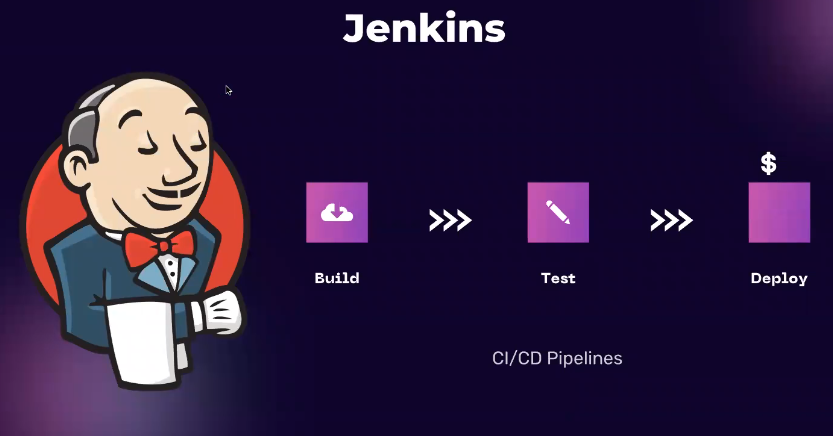

## JENKINS

-
---

## PART-1
- Jenkins is a open-source tool built in java.
- It is build automation tool used in CI/CD.
- Jenkins CI/CD -> Continuous Integraion - Continuous Delivery/Deployment
- CODE -> BUILD -> TEST -> DEPLOYMENT/DELIVERY
- Developer follow TEST DRIVEN DEVELOPMENT and Devops Guy should know how to run the tests.
- Delivery -> It involves "manual" intervention
- Deployment -> automated

- Github Code -> build -> test -> deploy (automated pipeline) -> Continuous Deployment
- Jenkins is run on dedicated server. You setup a server especially for the Jenkins to run.

# Start with setup and code

Here is the **plain, text-only step-by-step guide to set up Jenkins on Ubuntu** (no icons, no emojis).

---

## 1. Prerequisites

* Ubuntu 20.04 / 22.04 / 24.04
* Sudo user access
* Minimum 2 GB RAM
* Java installed

---

## 2. Install Java (OpenJDK 17)

```bash
sudo apt update
sudo apt install -y openjdk-17-jdk
```

Verify:

```bash
java -version
```

---

## 3. Add Jenkins Repository and GPG Key

Add Jenkins key:

```bash
curl -fsSL https://pkg.jenkins.io/debian-stable/jenkins.io-2023.key | sudo tee \
/usr/share/keyrings/jenkins-keyring.asc > /dev/null
```

Add Jenkins repository:

```bash
echo deb [signed-by=/usr/share/keyrings/jenkins-keyring.asc] \
https://pkg.jenkins.io/debian-stable binary/ | sudo tee \
/etc/apt/sources.list.d/jenkins.list > /dev/null
```

---

## 4. Install Jenkins

```bash
sudo apt update
sudo apt install -y jenkins
```

---

## 5. Start and Enable Jenkins

```bash
sudo systemctl start jenkins
sudo systemctl enable jenkins
```

Check status:

```bash
sudo systemctl status jenkins
```

---

## 6. Allow Port 8080 (Firewall)

```bash
sudo ufw allow 8080
sudo ufw reload
```

Skip if firewall is disabled.

---

## 7. Access Jenkins

Open in browser:

```
http://<server-ip>:8080
```

---

## 8. Unlock Jenkins

```bash
sudo cat /var/lib/jenkins/secrets/initialAdminPassword
```

Paste the password in the browser.

---

## 9. Complete Initial Setup

* Install suggested plugins
* Create admin user
* Confirm Jenkins URL
* Finish setup

---

## 10. Jenkins Important Locations

* Jenkins home: `/var/lib/jenkins`
* Config file: `/etc/default/jenkins`
* Logs: `/var/log/jenkins/jenkins.log`
* Default port: 8080

---

## 11. (Optional) Enable Docker Usage in Jenkins

```bash
sudo usermod -aG docker jenkins
sudo systemctl restart jenkins
```

---

## 12. Jenkins Service Commands

```bash
sudo systemctl start jenkins
sudo systemctl stop jenkins
sudo systemctl restart jenkins
sudo systemctl status jenkins
```

---


- Plugins extend Jenkins with additional features to support many different needs.


# Job-1 | Delivering django-app-code from github using freestyle job

- if the repo is private -> "ssh key"or "personal access token" are used
- Run a freestyle job (echo "hello world")

# Install docker on server
- sudo apt-get install docker.io
- sudo apt-get install docker-compose

# Edit the script to also build the container
```
echo "Running the django-container using docker-compose"

docker-compose down
docker-compose build --no-cache
docker-compose up -d

```

# Give permission to jenkins user to use docker
- sudo usermod -aG docker jenkins
- sudo reboot

- We can use Trigger(scm polling) with Github webhook with endpoint: (http://server-ip:8080/github-webhook)
- So, whenever we make any change to the code then, it will automatically trigger the workflow and push the code to jenkins where jenkins will create new updated image and run the container.

- Jenkins pipeline consists of sequence of stages -> 1. code -> 2. Build  -> 3. Test -> 4. Deploy
- If the stage fails and pipeline flow stop there only.

```
pipeline {
    agent any

    environment {
        APP_NAME = "demo-app"
        DOCKER_IMAGE = "adarsh5559/demo-app"
    }

    stages {

        stage('Checkout Code') {
            steps {
                git branch: 'main',
                    url: 'https://github.com/your-org/demo-app.git'
            }
        }

        stage('Build') {
            steps {
                echo "Building the application..."
                sh '''
                    mvn clean package -DskipTests
                '''
            }
        }

        stage('Test') {
            steps {
                echo "Running unit tests..."
                sh '''
                    mvn test
                '''
            }
        }

        stage('Docker Build') {
            steps {
                echo "Building Docker image..."
                sh """
                    docker build -t ${DOCKER_IMAGE}:${BUILD_NUMBER} .
                """
            }
        }

        stage('Deploy') {
            steps {
                echo "Deploying application..."
                sh '''
                    docker-compose down
                    docker-compose up -d --force-recreate
                '''
            }
        }
    }

    post {
        success {
            echo "Pipeline completed successfully"
        }

        failure {
            echo "Pipeline failed"
        }

        always {
            echo "Cleaning up workspace"
            cleanWs()
        }
    }
}

```