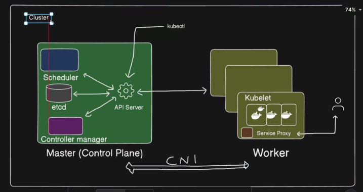
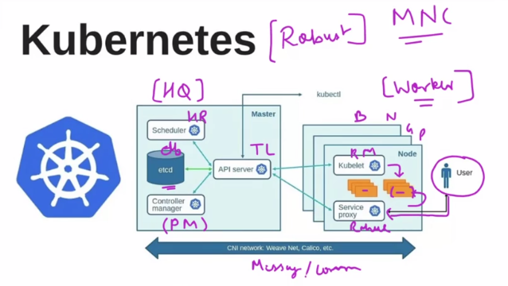
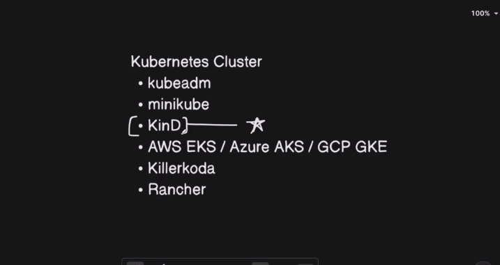
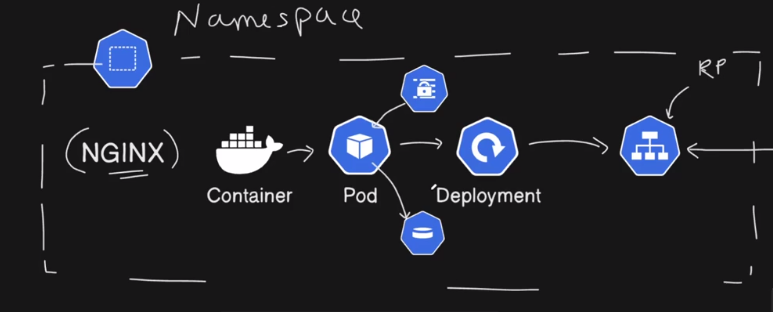
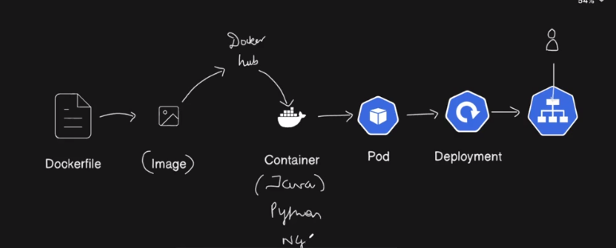

# Kubernetes|K8s

1. In 2014, Google made a project(Borg) to mangage the applications that has (Auto healing + Auto Scaling) capabilities for the applications.

2. This is helpful when application crashes and load increases suddenly.

3. They made this open source -> Kubernetes(K8s)

4. CNCF (Cloud Native Computing Foundation) organisation made K8s cloud native so that it will work on any cloud platform.

5. It is CNCF graduated project and no.1 orchestration tool.

6. It is written in GO language.

7. Kubernetes is an expensive application.

8. There are two type of applications:
   i. Monolith (frontend + backend + database) -> all at once -> Companies avoid this
   ii. Microservices -> collection of small and independent services running in conatainers. -> Kubernetes is suitable for this.

9. If a docker container fails then, we need manually up the container -> not used in production.

10. Now, we run docker containers using the tool Kubernetes to make the system (Auto scaling and Auto healing)

# Architechture

1. Kubernetes works on the concept of cluster(group of servers/nodes/instances)



2. (Workers Nodes -> multiple Worker Nodes)

3. Master Node | Controll Plane -> is a server comprising of tools and services that primary check if the worker nodes are working properly or not.




# Kubernetes Architecture (Detailed Explanation)

Kubernetes follows a **master–worker (control plane–node)** architecture.

```
                ┌────────────────────────┐
                │    Control Plane        │
                │ (Master Components)     │
                └──────────┬─────────────┘
                           │
        ───────────────────┼────────────────────
                           │
          ┌────────────────┴─────────────┐
          │        Worker Nodes            │
          │     (Application Runtime)     │
          └──────────────────────────────┘
```

---

## 1️⃣ High-Level View

Kubernetes architecture has **two main parts**:

| Layer             | Purpose                                                  |
| ----------------- | -------------------------------------------------------- |
| **Control Plane** | Makes decisions, schedules pods, maintains cluster state |
| **Worker Nodes**  | Run application containers                               |

---

## 2️⃣ Control Plane Components (Brain of Kubernetes)

The **control plane** manages the cluster.

### 🔹 Components

1. **kube-apiserver**
2. **etcd**
3. **kube-scheduler**
4. **kube-controller-manager**
5. **cloud-controller-manager** (optional)

---

### 2.1 kube-apiserver (Entry Point)

📌 **What it does**

- Central **REST API** for Kubernetes
- All communication goes through API server
- Authenticates & validates requests

📌 **Who talks to it**

- `kubectl`
- Scheduler
- Controllers
- Kubelet (nodes)

📌 **Example**

```bash
kubectl get pods
```

Flow:

```
kubectl → kube-apiserver → etcd → response
```

📌 **Key Point**

> No component talks directly to etcd except the API server.

---

### 2.2 etcd (Cluster State Database)

📌 **What it is**

- Distributed **key-value store**
- Stores **desired + current state** of cluster

📌 **Stores**

- Pod definitions
- ConfigMaps
- Secrets
- Node info
- Service metadata

📌 **Example**

```yaml
replicas: 3
```

This value is stored in etcd.

📌 **Important**

- etcd must be **backed up**
- Loss of etcd = loss of cluster state

---

### 2.3 kube-scheduler (Pod Placement)

📌 **What it does**

- Decides **which node runs a pod**
- Does NOT run pods

📌 **Scheduling factors**

- CPU / Memory
- Node affinity
- Taints & tolerations
- Pod affinity

📌 **Example**
You deploy:

```yaml
replicas: 3
```

Scheduler:

```
Pod1 → Node A
Pod2 → Node B
Pod3 → Node C
```

📌 **Flow**

```
Pod created → no node assigned → scheduler picks node → updates API server
```

---

### 2.4 kube-controller-manager (State Reconciliation)

📌 **What it does**

- Ensures **desired state = actual state**
- Runs multiple controllers

📌 **Important controllers**

- Node Controller
- ReplicaSet Controller
- Deployment Controller
- Endpoint Controller

📌 **Example (Self-Healing)**
You want **3 replicas**, but one pod crashes:

```
Desired: 3
Current: 2
```

Controller:

```
Creates 1 new pod
```

📌 **Key Concept**

> Kubernetes is **declarative**, not imperative.

---

### 2.5 cloud-controller-manager (Cloud Integration)

📌 **Only for cloud providers**

- AWS / GCP / Azure

📌 **Handles**

- Load balancers
- Volumes
- Node lifecycle

📌 **Example**

```yaml
type: LoadBalancer
```

➡ AWS ELB created automatically.

---

## 3️⃣ Worker Node Components (Execution Layer)

Each worker node runs:

1. **kubelet**
2. **container runtime**
3. **kube-proxy**

---

### 3.1 kubelet (Node Agent)

📌 **What it does**

- Talks to API server
- Ensures pods are running
- Reports node status

📌 **Example**

```
API Server: Run nginx pod
kubelet: Pull image → start container
```

📌 **Important**

- kubelet never talks to etcd directly

---

### 3.2 Container Runtime (Runs Containers)

📌 **Examples**

- containerd (most common)
- CRI-O
- Docker (deprecated)

📌 **What it does**

- Pull images
- Start/stop containers

📌 **Example**

```yaml
image: nginx:latest
```

---

### 3.3 kube-proxy (Networking)

📌 **What it does**

- Handles **Service networking**
- Implements load balancing
- Uses iptables / IPVS

📌 **Example**
Service:

```yaml
type: ClusterIP
```

Traffic:

```
Client → Service IP → kube-proxy → Pod
```

📌 **Without kube-proxy**
Services won’t work.

---

## 4️⃣ Pod Networking (How Pods Communicate)

📌 **Rules**

1. Every Pod gets a **unique IP**
2. Pods can talk to each other **without NAT**
3. Nodes can talk to pods directly

📌 **Achieved using CNI plugins**

- Calico
- Flannel
- Weave
- Cilium

📌 **Example**

```
Pod A (10.244.1.5) → Pod B (10.244.2.8)
```

---

## 5️⃣ Complete Request Flow (Real Example)

### Scenario: Deploy NGINX

```bash
kubectl apply -f nginx.yaml
```

### Step-by-step Flow

1. `kubectl` → **kube-apiserver**
2. API server validates YAML
3. State stored in **etcd**
4. Scheduler selects node
5. Controller ensures replicas
6. kubelet pulls image
7. Container runtime runs container
8. kube-proxy enables service routing

---

## 6️⃣ Kubernetes Architecture Diagram (Textual)

```
User
 │
kubectl
 │
kube-apiserver
 │
etcd
 │
├─ kube-scheduler
├─ controller-manager
│
Worker Node
 ├─ kubelet
 ├─ container runtime
 └─ kube-proxy
```

---

## 7️⃣ Key Design Principles

| Principle       | Explanation                      |
| --------------- | -------------------------------- |
| Declarative     | You define **what**, not **how** |
| Self-Healing    | Auto restart & reschedule        |
| Loosely Coupled | Components communicate via API   |
| Extensible      | CRDs & Operators                 |

---

## 8️⃣ Interview-Level Summary (1-Minute)

> Kubernetes has a **control plane** responsible for decision-making and a **worker plane** that runs applications.
> The **API server** is the central component, storing state in **etcd**.
> The **scheduler** assigns pods to nodes, and controllers ensure the desired state is always met.
> Worker nodes use **kubelet** to manage pods, **container runtime** to run containers, and **kube-proxy** for networking.
> The architecture is declarative, scalable, and self-healing.

---

# Creating the Cluster



The image lists **three ways to create a Kubernetes cluster**:

- **kubeadm**
- **minikube**
- **Kind (Kubernetes in Docker)** ⭐

They are often confused, but they serve **very different purposes**. I’ll explain them **conceptually**, **architecturally**, and **with real use cases**, so the difference is crystal clear (exam + interview ready).

---

# kubeadm vs minikube vs Kind (KinD)

## 1️⃣ kubeadm — _Production-grade cluster bootstrap tool_

### What kubeadm is

- A **cluster bootstrapping tool**
- Used to set up **real Kubernetes clusters**
- Often used in **production** and **on-prem environments**

> kubeadm does **not** run Kubernetes for you — it **initializes** it.

---

### Architecture

- Creates a **real multi-node cluster**
- Control plane + worker nodes run on **VMs or bare metal**
- Uses real:
  - etcd
  - kube-apiserver
  - scheduler
  - controller-manager

```
VM / Bare Metal
 ├─ Control Plane
 └─ Worker Nodes
```

---

### Example

```bash
kubeadm init
kubeadm join
```

---

### When to use kubeadm

✅ Production clusters
✅ On-prem data centers
✅ Cloud VMs (EC2, GCE, etc.)
✅ When you want **full control**

---

### Pros

✔ Production ready
✔ Full Kubernetes behavior
✔ Supports HA control plane

### Cons

❌ Complex setup
❌ Needs networking, load balancer, etc.
❌ Not beginner friendly

---

## 2️⃣ minikube — _Local single-node learning cluster_

### What minikube is

- A **local Kubernetes environment**
- Designed for **learning & development**
- Runs Kubernetes inside a **VM or container**

> minikube = “Kubernetes on my laptop”

---

### Architecture

- **Single-node cluster**
- Control plane + worker on **same node**
- Runs via:
  - Docker
  - VirtualBox
  - KVM

```
Laptop
 └─ One Node
    ├─ Control Plane
    └─ Worker
```

---

### Example

```bash
minikube start
kubectl get nodes
```

---

### When to use minikube

✅ Beginners
✅ Learning Kubernetes
✅ Testing manifests locally
✅ Demos

---

### Pros

✔ Very easy to use
✔ One command start
✔ Built-in addons (Ingress, Dashboard)

### Cons

❌ Not production-like
❌ Single-node by default
❌ Not ideal for CI/CD testing

---

## 3️⃣ Kind (Kubernetes in Docker) ⭐ — _Best for CI/CD & testing_

### What Kind is

- Runs **Kubernetes clusters inside Docker containers**
- Each node = one Docker container
- Widely used for **testing Kubernetes itself**

> Kind is Kubernetes running **inside Docker**, not VMs.

---

### Architecture

- Multi-node cluster
- Nodes are **Docker containers**
- Very fast & lightweight

```
Laptop / CI Runner
 ├─ Docker Container (Control Plane)
 ├─ Docker Container (Worker 1)
 └─ Docker Container (Worker 2)
```

---

### Example

```bash
kind create cluster --name test
```

Multi-node config:

```yaml
kind: Cluster
nodes:
  - role: control-plane
  - role: worker
  - role: worker
```

---

### When to use Kind

✅ CI/CD pipelines
✅ Kubernetes testing
✅ Helm chart testing
✅ Fast multi-node clusters locally

---

### Pros

✔ Extremely fast
✔ Multi-node support
✔ Perfect for CI/CD
✔ Lightweight

### Cons

❌ Not for production
❌ Networking is Docker-based
❌ No cloud integrations

---

## 4️⃣ Side-by-Side Comparison (Very Important)

| Feature        | kubeadm              | minikube        | Kind              |
| -------------- | -------------------- | --------------- | ----------------- |
| Purpose        | Production bootstrap | Local learning  | Testing / CI      |
| Runs on        | VMs / Bare metal     | VM or container | Docker containers |
| Multi-node     | ✅ Yes               | ❌ (default)    | ✅ Yes            |
| Production use | ✅ Yes               | ❌ No           | ❌ No             |
| CI/CD friendly | ❌ Hard              | ❌ No           | ✅ Best           |
| Ease of setup  | ❌ Hard              | ✅ Very easy    | ✅ Easy           |
| Speed          | Medium               | Medium          | 🚀 Fast           |

---

## 5️⃣ Simple Analogy (Interview Gold)

- **kubeadm** → _Building a real data center_
- **minikube** → _Practicing in a home lab_
- **Kind** → _Automated testing factory_

---

## 6️⃣ Which one should YOU use?

Based on your background (DevOps + Kubernetes learning):

- 🔹 **Learning Kubernetes** → **minikube**
- 🔹 **CI/CD pipelines** → **Kind**
- 🔹 **Real cluster / production prep** → **kubeadm**

---

## 7️⃣ One-Line Interview Answers

- **kubeadm**: _Tool to bootstrap production-grade Kubernetes clusters_
- **minikube**: _Local single-node Kubernetes for learning_
- **Kind**: _Docker-based Kubernetes for testing and CI/CD_

---

# kinD cluster startup

1. Create a EC2 instance -> t2.medium | 20GB storage
2. sudo apt-get update

# Install Docker

3. sudo apt-get install docker.io
4. sudo usermod -aG docker $USER
5. newgrp docker
6. docker ps

# Install kinD

7. Go to kind website and install kind -> [ $(uname -m) = x86_64 ] && curl -Lo ./kind https://kind.sigs.k8s.io/dl/v0.31.0/kind-linux-amd64
8. chmod +x ./kind
9. ./kind --version
10. sudo mv ./kind /usr/local/bin/kind
11. kind --version

# Install kubectl

12. Go to kubectl install website
13. chmod +x kubectl
14. ./kubectl version
15. ./kubectl --help
16. sudo mv ./kubectl /usr/local/bin/kubectl
17. kubectl version

# creating the cluster -> we require the configurations

18. Everything in K8s is a manifest.yml file -> configuration file

# demo.yml

```
name: "adarsh"
age: 23
hobbies:
    - teaching
    - workout
    - timepass
work:
    fulltime:
        name: Microsoft
        designation: devops engineer
        tasks:
            - python
            - devops
            - aws

    parttime:
        name: trainwithadarsh
        designation: support
```

19. mkdir kubernetes-practice
20. cd kubernetes-practice
21. vim cluster.yml

```
kind: Cluster
apiVersion:  kind.x-k8s.io/v1alpha4

nodes:
  - role: control-plane
    image: kindest/node:v1.34.2

  - role: worker
    image: kindest/node:v1.34.2

  - role: worker
    image: kindest/node:v1.34.2

  - role: worker
    image: kindest/node:v1.34.2
```

22. Apply -> kind create cluster --config cluster.yml --name kub-cluster
23. kubectl get nodes
24. docker ps -> shows container for each node
25. docker exec -it afd402e53826 bash -> (master container)
26. docker ps -> docker is not there in master node
27. top -> to see the running services like etcd, schedular, controller, apiserver
28. kubectl cluster-info

29. kubectl config set-context --cluster=kind-kub-cluster --current -> contex switching between differnt cluster
30. kubectl config get-contexts -> kubectl config -h

31. kubectl will running on that cluster to which you have setup the 'set-context' -> so firstly set the context for the particular cluster before using kubectl on that

# What is a Namespace? (simple definition)

- A namespace is a logical partition inside a Kubernetes cluster used to group, isolate, and manage resources.

# Why namespaces exist (the real reason)

- Kubernetes is one big cluster, but multiple teams/apps need to share it.

- Namespaces help with:

1. Isolation
2. Organization
3. Access control
4. Resource limits

Kubernetes Cluster
│
├── namespace: dev
│ ├── pods
│ ├── services
│ └── deployments
│
├── namespace: staging
│ ├── pods
│ └── services
│
├── namespace: prod
│ └── pods
│
└── namespace: kube-system
└── core k8s components

- Same resource names CAN exist in different namespaces

32. kubectl get ns

✅ Namespaced resources

- Pods
- Services
- Deployments
- ConfigMaps
- Secrets
- Jobs
- Ingress
- StatefulSets

❌ Cluster-wide (NOT namespaced)

- Nodes
- PersistentVolumes
- StorageClasses
- Namespaces themselves

33. kubectl get pods -n dev
34. kubectl get nodes # no namespace

# Why namespaces matter in real projects

1️⃣ Environment separation
dev → testing
staging → pre-prod
prod → live users

- Same app, same YAML, different namespace.

2️⃣ Access control (RBAC)

Example:

- Dev team → access only dev namespace
- Ops team → access all namespaces
- This is enforced via Roles & RoleBindings.

3️⃣ Resource limits & quotas

You can limit:

- CPU
- Memory
- Pod count

35. kubectl delete ns dev

36. kubectl get pods -> looks for the default namespace
37. kubectl get pods -n dev -> particular namespace
38. kubectl config set-context --current --namespace=dev

- A namespace is a logical isolation mechanism in Kubernetes used to org anize resources, manage access, and apply quotas within a shared cluster.




# namespace.yml

```
kind: Namespace
apiVersion: v1

metadata:
  name: nginx-ns
```

# pod.yml

```
kind: Pod
apiVersion: v1
metadata:
  name: nginx-pod
  namespace: nginx-ns
spec:
  containers:
  - name: nginx
    image: nginx:latest
    ports:
    - containerPort: 80

```

39. kubectl get pods -n nginx-ns -> to get pods of particular namespace

40. kubectl apply -f file.yml -> (-f=file)

