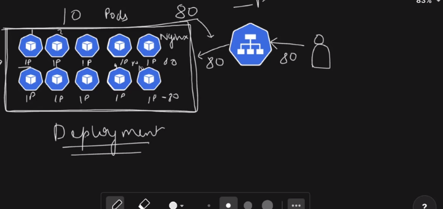

# Kubernetes | k8s

1. kubectl delete pod nginx-pod -n nginx-ns

2. kubectl delete -f deployment.yml -> deletion using the file

3. If traffic increases on a particular pod then, we need to scale it up / replicas create karne honge

4. Let's we want to implement the desired state i.e. mainting 10-pods to run simultaneously -> done using deployment

5. Because if create only 'pod' and later we delete it then, it will not auto-heal or auto-scale itself. So, we create deployments.

6. Deployments help use to match the current state of the resources with the desired state of the resources in cluster.

7. Deployements help use to scale up/scale down -> for stateless application -> that does not need to persist the data in them.


8. kubectl apply -f deployment.yml --dry-run=client => (to verify if deplyemnt can be created or not)

9. kubectl get deployments -n nginx-ns
10. kubectl get pods -n nginx-ns
11. kubectl delete pod nginx-deployment-78b4b9dbdd-kxzvd -n nginx-ns -> (even if you delete the pod, it will auto-heal itself to match the desired state of resources)

12. kubectl scale deployment nginx-deployment -n nginx-ns --replicas=5 (scale up/down by specifying the replica count)

# Deployment.yml

```
apiVersion: apps/v1
kind: Deployment

metadata:
  name: nginx-deployment
  namespace: nginx-ns
  labels:
    app: nginx

spec:
  replicas: 3
  selector:
    matchLabels:
      app: nginx

  template:
    metadata:
      name: nginx-pod
      namespace: nginx-ns
      labels:
        app: nginx

    spec:
      containers:
      - name: nginx
        image: nginx:1.14
        ports:
        - containerPort: 80
```

# What is a 'Rolling Update' in Kubernetes | Deployment Strategy?

A Rolling Update is a deployment strategy in Kubernetes where your application is updated gradually, without downtime, by:

Creating new Pods with the updated version

Slowly terminating old Pods

Ensuring the app remains available throughout the update

👉 This is the default update strategy for a Deployment.

Why Rolling Updates Exist (Real-world problem)

Imagine your app has 5 running Pods (v1).

You want to deploy v2.

❌ Bad approach (downtime)

Stop all v1 Pods

Start all v2 Pods
⛔ Users see downtime

✅ Rolling update approach

Start 1 new v2 Pod

Once it’s ready → stop 1 old v1 Pod

Repeat until all Pods are v2
✅ Users never notice the update

Rolling Update in Simple Terms

“Replace old Pods with new Pods one by one (or in small batches) while keeping the app live.”

```
Step-by-Step What Happens Internally

Let’s say:

replicas = 4
maxUnavailable = 1
maxSurge = 1

Rolling update flow:

Kubernetes creates 1 new Pod (v2) → total Pods = 5
New Pod becomes Ready
Kubernetes deletes 1 old Pod (v1) → Pods = 4
Repeat steps until all Pods are v2
```

13. watch kubectl get pods -n nginx-ns -> to rerun this command after sometime

14. kubectl get rs -n nginx-ns (replicaset)

---

## What is a ReplicaSet?

A **ReplicaSet** is a Kubernetes object whose **only responsibility** is:

> 👉 **Ensure a specified number of identical Pods are always running**

If a Pod:

- crashes ❌
- gets deleted ❌
- node goes down ❌

The ReplicaSet **automatically creates a new Pod** to replace it.

---

## One-line Definition (Interview-ready)

> **ReplicaSet ensures the desired number of Pod replicas are running at all times.**

---

## Simple Example

```yaml
apiVersion: apps/v1
kind: ReplicaSet
metadata:
  name: myapp-rs
spec:
  replicas: 3
  selector:
    matchLabels:
      app: myapp
  template:
    metadata:
      labels:
        app: myapp
    spec:
      containers:
        - name: myapp
          image: nginx
```

✔ Kubernetes will always try to keep **3 nginx Pods running**

---

## What Happens If a Pod Dies?

1. Pod crashes
2. ReplicaSet detects replicas < desired count
3. New Pod is created automatically

👉 Self-healing in action.

---

## Now the BIG QUESTION 👇

## How is ReplicaSet Related to Deployment?

### Short Answer

> **Deployment manages ReplicaSets, and ReplicaSets manage Pods.**

### Hierarchy (Very Important)

```
Deployment
   ↓
ReplicaSet
   ↓
Pods
```

---

## What Does a Deployment Actually Do?

A **Deployment** is a **higher-level controller** that provides:

- Rolling updates
- Rollbacks
- Version history
- Safer releases

Internally, it does this by **creating and managing ReplicaSets**.

---

## Deployment → ReplicaSet Relationship (Real Example)

### Step 1: You create a Deployment

```bash
kubectl apply -f deployment.yaml
```

### Step 2: Kubernetes automatically creates:

- 1 ReplicaSet
- N Pods (via that ReplicaSet)

You **never manually create** the ReplicaSet here.

---

## During a Rolling Update (Key Insight 🔥)

Let’s say:

- App v1 is running
- You update image to v2

### What Kubernetes Does Internally:

1. **Old ReplicaSet (v1)** still exists
2. **New ReplicaSet (v2)** is created
3. Pods are gradually shifted from old RS → new RS
4. Old RS is scaled down
5. New RS becomes active

👉 This is how **zero-downtime rolling updates** work.

---

## Visual Flow of Rolling Update

```
Before update:
Deployment
 └─ ReplicaSet-v1 → Pod1, Pod2, Pod3

After update:
Deployment
 ├─ ReplicaSet-v1 → Pod1
 └─ ReplicaSet-v2 → PodA, PodB
```

---

## Why You Should NOT Use ReplicaSet Directly

| Problem                | Explanation                      |
| ---------------------- | -------------------------------- |
| ❌ No rolling updates  | ReplicaSet can’t manage versions |
| ❌ No rollback         | No history                       |
| ❌ Manual updates      | Risky                            |
| ❌ Not production-safe | Missing safety features          |

✔ **Best practice**:

> **Always use Deployment instead of ReplicaSet directly**

---

## When Would You Use ReplicaSet Directly?

Almost never.

ReplicaSet is mostly:

- Used **internally by Deployments**
- Important for **understanding**, debugging, interviews

---

## How to See ReplicaSets Created by a Deployment

```bash
kubectl get rs
```

```bash
kubectl describe deployment myapp
```

You’ll see ReplicaSets like:

```
myapp-7f8d9c6b5d
myapp-5c9b8f4d6a
```

---

## Key Difference Summary (Interview Table)

| Feature             | ReplicaSet | Deployment      |
| ------------------- | ---------- | --------------- |
| Manages Pods        | ✅         | ❌ (indirectly) |
| Manages ReplicaSets | ❌         | ✅              |
| Rolling updates     | ❌         | ✅              |
| Rollback            | ❌         | ✅              |
| Version history     | ❌         | ✅              |
| Production usage    | ❌         | ✅              |

---

## Golden Interview Answer (Use This)

> A **ReplicaSet** ensures a fixed number of Pods are always running, while a **Deployment** is a higher-level abstraction that manages ReplicaSets to enable rolling updates, rollbacks, and version control.

---


# Service


Great, this completes the **core Kubernetes triangle**: **Pod → Deployment → Service**.
Let’s explain **Service** in a way that *actually makes sense* and sticks.

---

## What is a Service in Kubernetes?

A **Service** is a Kubernetes object that provides:

> 👉 **A stable network identity (IP + DNS) and load-balancing for a set of Pods**

Because **Pods are temporary**:

* Pod IPs change
* Pods die & get recreated
* You cannot directly rely on Pod IPs

So Kubernetes gives you a **Service** as a permanent access point.

---

## One-Line Interview Definition

> **A Service exposes a group of Pods under a stable IP and DNS name and distributes traffic among them.**

---

## The Core Problem Services Solve

### Without a Service ❌

* Frontend talks to Pod IP `10.244.0.7`
* Pod crashes
* New Pod IP = `10.244.0.15`
* App breaks 💥

### With a Service ✅

* Frontend talks to `myapp-service`
* Pods change behind the scenes
* Service keeps routing traffic correctly

---

## How Service Works Internally

```
Client
  ↓
Service (Stable IP + DNS)
  ↓
Label Selector
  ↓
Matching Pods
```

👉 Service does **NOT** create Pods
👉 Service **selects Pods using labels**

---

## Simple Service Example

### Pod / Deployment labels

```yaml
labels:
  app: myapp
```

### Service

```yaml
apiVersion: v1
kind: Service
metadata:
  name: myapp-service
spec:
  selector:
    app: myapp
  ports:
    - port: 80
      targetPort: 3000
```

✔ Any Pod with label `app: myapp` receives traffic
✔ Service listens on **80**, forwards to **3000** inside Pods

---

## Key Fields Explained

### 1️⃣ `selector`

```yaml
selector:
  app: myapp
```

* Connects Service → Pods
* Label matching is **mandatory**

---

### 2️⃣ `port`

```yaml
port: 80
```

* Port exposed by the Service

---

### 3️⃣ `targetPort`

```yaml
targetPort: 3000
```

* Port on the container where app runs

---

## Types of Services (VERY IMPORTANT)

### 1️⃣ ClusterIP (Default)

```yaml
type: ClusterIP
```

* Accessible **only inside the cluster**
* Used for internal communication (backend, DB, APIs)

✔ Most common service type

Example:

```yaml
spec:
  type: ClusterIP
```

---

### 2️⃣ NodePort

```yaml
type: NodePort
```

* Exposes service on **every node’s IP**
* Port range: **30000–32767**

Access:

```
<NodeIP>:NodePort
```

✔ Often used in **Minikube / Dev environments**

Example:

```yaml
spec:
  type: NodePort
  ports:
    - port: 80
      targetPort: 3000
      nodePort: 30007
```

---

### 3️⃣ LoadBalancer

```yaml
type: LoadBalancer
```

* Creates a **cloud load balancer** (AWS ELB, GCP LB, etc.)
* Publicly accessible

✔ Used in production on cloud providers

---

### 4️⃣ Headless Service

```yaml
clusterIP: None
```

* No load balancing
* Returns Pod IPs directly

✔ Used for:

* StatefulSets
* Databases (MongoDB, Kafka)

---

## How Service Load Balances Traffic

* Uses **iptables / IPVS**
* Round-robin distribution
* Completely transparent to the app

---

## Service vs Deployment vs Pod (Big Picture)

| Component   | Responsibility       |
| ----------- | -------------------- |
| Pod         | Runs containers      |
| ReplicaSet  | Maintains pod count  |
| Deployment  | Updates & versioning |
| **Service** | Networking & access  |

---

## How Services Discover Pods

Using **labels & selectors**:

```bash
kubectl get pods --show-labels
```

```bash
kubectl describe service myapp-service
```

You’ll see **Endpoints**:

```
Endpoints: 10.244.0.5:3000, 10.244.0.6:3000
```

---

## DNS Magic ✨

Kubernetes automatically creates DNS:

```
myapp-service.default.svc.cluster.local
```

Inside the cluster, you can just use:

```
http://myapp-service
```

---

## Real-Life Analogy 🏢

* Pods = employees (come & go)
* Service = company phone number
* Caller doesn’t care who answers
* Calls always go through

---

## Common Mistakes (Important)

❌ Service selector doesn’t match Pod labels
❌ Wrong `targetPort`
❌ Expecting Service to expose app without NodePort/LB
❌ Trying to use Pod IPs directly

---

## Interview Power Answer 🔥

> A Kubernetes Service provides a stable network endpoint to access a group of Pods, handling service discovery and load balancing, regardless of Pod lifecycle changes.

---


# Type of service
- NodePort
- ClusterIp -> Default -> if not type is provided
- ExternalIp
- LoadBalancer -> (EKS -> ELB)
- Headless -> (stateful)

15. Label of deployment should match with Label of service.

# service.yml
```
apiVersion: v1
kind: Service

metadata:
    name: nginx-svc
    namespace: nginx-ns

spec:
    selector:
        app: nginx
    ports:
        - protocol: TCP
          port: 82      # cluster /host port [service]
          targetPort: 80   # container port


```

16. kubectl apply -f service.yml
17. kubectl get svc/services -n nginx-ns

18. User => EC2 Node-> KinD(layer) -> Kubernetes Cluster(82 -> using ClusterIp) -> Service(82) -> Deployment(80) -> Pod -> container(Nginx-80)

19. Due to extra kinD layer -> need to forward the port of service to node 

20. sudo -E (to give environment  of root user)

21. sudo -E kubectl port-forward svc/nginx-svc -n nginx-ns 82:82 --address=0.0.0.0

22. Go and give access to port-82 in Inbound rule of node -> to allow user to access the page on broswer using PublicIP:82

23. kubectl scale deployment nginx-deployment -n nginx-ns --replicas=5/0 (scale up/down)


# Deploying online-shopping-app
1. git clone <repo>
2. docker build -t online_shop_app:latest . -> (push image of DockerHub)
3. docker image tag online_shop_app:latest adarsh5559/online_shop_app:latest
4. Login to docker-hub (can use PAT)
5. docker push adarsh5559/online_shop_app:latest
6. Create a <k8s>repo for deployment

7. vim namespace.yml 

```
apiVersion: v1
kind: Namespace

metadata:
    name: online-shop-ns
```

8. kubectl apply -f namespace.yml
9. kubectl get ns

10. vim deployment.yml

```
apiVersion: apps/v1
kind: Deployment

metadata:
    name: online-shop-deployment
    namespace: online-shop-ns
    labels:
        app: online-shop
spec:
    replicas: 2
    selector:
        matchLabels:
            app: online-shop
    template:
        metadata:
            name:  online-shop-pod
            namespace: online-shop-ns
            labels:
                app: online-shop
        spec:
            containers:
            - name: online-shop-container
              image: adarsh5559/online_shop_app:latest
              ports:
              - containerPort: 80
            

```
11.  kubectl apply -f deployment.yml 
12. kubectl get deployments -n online-shop-ns
13. kubectl get pods -n online-shop-ns
14. To make the pod accessible to outside world make service
15. vim service.yml

```
apiVersion: v1
kind: Service

metadata:
    name: online-shop-svc
    namespace: online-shop-ns

spec:
    selector:
        app: online-shop
    ports:
        - protocol: TCP
          port: 84
          targetPort: 80

```

16. kubectl apply -f service.yml
17. kubectl get svc -n online-shop-ns
18. kubectl get all -n online-shop-ns (total info of namespace: pods + deployments + services + replicas)

- expose the service to node
19. kubectl port-forward svc/online-shop-svc -n online-shop-ns 84:84 --address=0.0.0.0
20. expose the port in security group inbound rules for port:84

---


## Ingress

Awesome, this is the **last big networking pillar** in Kubernetes.
If you understand **Ingress properly**, Kubernetes networking finally *clicks* 🔥

I’ll go **concept → why → how → flow → types → example → common mistakes → interview answers**.

---

# What is Ingress in Kubernetes?

**Ingress is NOT a Service.**

👉 **Ingress is an API object that manages external HTTP/HTTPS access to services inside a Kubernetes cluster.**

It provides:

* URL-based routing
* Host-based routing
* TLS / HTTPS termination
* Centralized entry point for multiple services

---

## One-Line Interview Definition

> **Ingress exposes HTTP and HTTPS routes from outside the cluster to internal Services using rules defined on hosts and paths.**

---

# Why Ingress Exists (The Problem)

Without Ingress 👇

| App      | Exposure                |
| -------- | ----------------------- |
| frontend | NodePort / LoadBalancer |
| backend  | NodePort / LoadBalancer |
| auth     | NodePort / LoadBalancer |

Problems:

* Many public IPs ❌
* No central routing ❌
* No TLS management ❌
* Costly in cloud ❌

---

## With Ingress ✅

```
Single LoadBalancer IP
        ↓
      Ingress
        ↓
   Path / Host routing
        ↓
   Multiple Services
```

✔ One IP
✔ Clean URLs
✔ TLS at one place
✔ Production-ready

---

# Key Components (VERY IMPORTANT)

Ingress works only if **all 3 exist**:

| Component              | Purpose                |
| ---------------------- | ---------------------- |
| **Ingress Resource**   | Rules (YAML)           |
| **Ingress Controller** | Actual traffic handler |
| **Service**            | Backend target         |

🚨 **Ingress alone does nothing without a controller**

---

# What is an Ingress Controller?

An **Ingress Controller** is a Pod that:

* Watches Ingress objects
* Configures a reverse proxy (NGINX, Traefik, HAProxy)
* Routes real traffic

Popular controllers:

* NGINX Ingress Controller (most common)
* Traefik
* HAProxy
* Cloud-specific (AWS ALB, GCE)

---

# Traffic Flow (CRITICAL)

```
Browser
  ↓
DNS (example.com)
  ↓
Cloud LoadBalancer / NodePort
  ↓
Ingress Controller (NGINX)
  ↓
Ingress Rules
  ↓
Service
  ↓
Pod
```

Ingress **never talks to Pods directly** — only Services.

---

# Basic Ingress Example

```yaml
apiVersion: networking.k8s.io/v1
kind: Ingress
metadata:
  name: shop-ingress
spec:
  rules:
  - host: shop.example.com
    http:
      paths:
      - path: /
        pathType: Prefix
        backend:
          service:
            name: frontend-svc
            port:
              number: 80
```

---

## What This Does

| Request             | Routed To       |
| ------------------- | --------------- |
| `shop.example.com/` | frontend-svc:80 |

---

# Path-Based Routing Example

```yaml
paths:
- path: /api
  pathType: Prefix
  backend:
    service:
      name: backend-svc
      port:
        number: 8080
```

Result:

* `/api/*` → backend service
* `/` → frontend service

---

# Host-Based Routing Example

```yaml
rules:
- host: frontend.shop.com
  ...
- host: api.shop.com
  ...
```

✔ Multiple domains → same cluster

---

# TLS / HTTPS with Ingress 🔐

Ingress handles SSL termination.

```yaml
tls:
- hosts:
  - shop.example.com
  secretName: shop-tls
```

✔ Browser → HTTPS
✔ Ingress decrypts → forwards HTTP to services

---

# Ingress vs Service (Very Important)

| Feature            | Service | Ingress             |
| ------------------ | ------- | ------------------- |
| L4 / L7            | L4      | **L7 (HTTP/HTTPS)** |
| Routing            | No      | Yes                 |
| Path-based routing | ❌       | ✅                   |
| TLS termination    | ❌       | ✅                   |
| Exposes Pods       | Yes     | Indirect            |

---

# Ingress vs NodePort vs LoadBalancer

| Type         | Use Case            |
| ------------ | ------------------- |
| NodePort     | Dev / testing       |
| LoadBalancer | Single service prod |
| **Ingress**  | Multi-service prod  |

---

# Real-World Example

```
https://shop.com        → frontend
https://shop.com/api    → backend
https://shop.com/admin  → admin
```

All behind **one public IP**.

---

# Common Mistakes 🚨

❌ No ingress controller installed
❌ Service type mismatch
❌ Wrong service port
❌ Missing DNS mapping
❌ Expecting Ingress to expose TCP/UDP (it doesn’t)

---

# Ingress is Layer-7 (Interview Gold)

Ingress understands:

* URLs
* Headers
* Cookies
* Hostnames

Services don’t.

---

# When NOT to Use Ingress

* Non-HTTP protocols (DB, Redis)
* gRPC without proper controller
* Very simple apps

---

# Ingress vs API Gateway (Bonus)

Ingress:

* Cluster-level routing

API Gateway:

* Auth, rate-limit, transforms

Often used **together**.

---

# Production Stack Example

```
AWS ALB / NGINX Ingress
        ↓
Kubernetes Services
        ↓
Microservices Pods
```

---

# Interview-Ready Answer (Perfect)

> Ingress is a Kubernetes API object that manages external HTTP and HTTPS access to services within a cluster, providing features such as path-based routing, host-based routing, and TLS termination through an Ingress controller.

---

## Ingress project


1. Ingress give path-based routing to a service.
2. Ingress has ingress(nginx-based-controller) that redirects the traffic to service as per the route/path.
3. You have to install ingress controller inside the k8s.
4. visit the kind-ingress website -> kubectl apply -f https://kind.sigs.k8s.io/examples/ingress/deploy-ingress-nginx.yaml
5. kubectl get svc -n ingress-nginx 
6. kubectl get pods -n ingress-nginx 
7. you have to expose this ingress-controller-svc using port-forwarding.
8. sudo -E kubectl port-forward svc/ingress-nginx-controller -n ingress-nginx 84:80 --address=0.0.0.0 & ->('&' runs the commands in the background without blocking the terminal)
9. Expose the port-80 in the security groups.
10. Upto here ingress-nginx-controller service should work.
11. Now, we have to attach the app-service to it for redirection.

12. vim ingress.yml

```
kind: Ingress
metadata:
  name: online-shop-ingress
  namespace: online-shop-ns
  annotations:
    nginx.ingress.kubernetes.io/rewrite-target: /$2
spec:
  ingressClassName: nginx
  rules:
  - http:
      paths:
      - path: /shop(/|$)(.*)
        pathType: ImplementationSpecific
        backend:
          service:
            name: online-shop-svc
            port:
              number: 80


```

13. kubectl apply -f ingress.yml 
14. kubectl get ing -n online-shop-ns -> ingress maps to  -> ingress controller port 80


