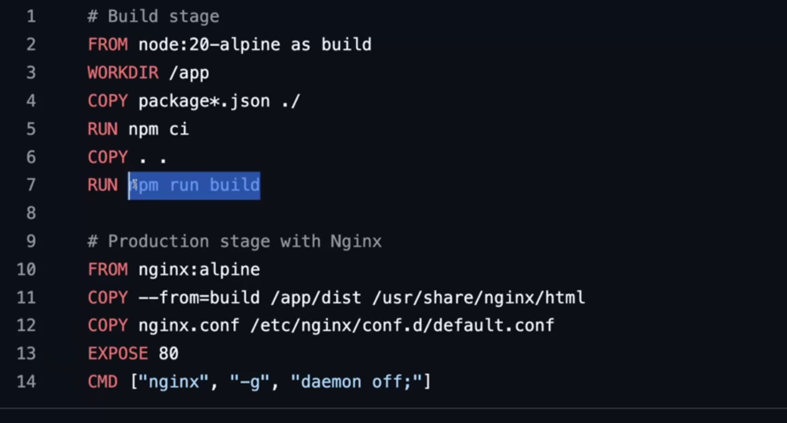
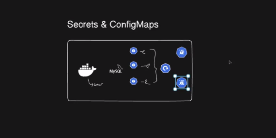
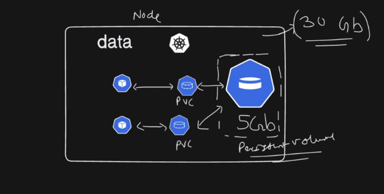

## Kubernetes | part-3

1. kubectl delete -f . -> to delete everything created from .yml files
2. kubectl get ns
3. kubectl get all -n ingress-nginx

f

# Secrets and ConfigMaps



Great question — this is one of those **core Kubernetes concepts** that quietly powers almost every real production setup. Let’s break it down cleanly and practically 👇

---

## Why do we even need ConfigMaps & Secrets? (The Big Picture)

In Kubernetes, **applications should be portable and environment-agnostic**.

That means:

* Same Docker image runs in **dev, staging, prod**
* Only **configuration changes**, not code

So we separate:

* **Code** → inside container image
* **Configuration & credentials** → provided at runtime

That’s where **ConfigMaps** and **Secrets** come in.

---

# 1️⃣ ConfigMaps

### 🔹 What is a ConfigMap?

A **ConfigMap** stores **non-sensitive configuration data** in key–value format.

Examples:

* Environment variables
* App config files
* Feature flags
* URLs, ports, log levels

---

### 🔹 Why ConfigMaps are needed

Without ConfigMaps:

* You hardcode configs into the image ❌
* Need to rebuild image for every env ❌
* Bad DevOps practice ❌

With ConfigMaps:

* Change config **without rebuilding images**
* Same image → different behavior per environment
* Cleaner, safer, scalable

---

### 🔹 Common use cases

```text
APP_ENV=production
LOG_LEVEL=debug
DB_HOST=postgres-service
REDIS_URL=redis:6379
```

---

### 🔹 Example ConfigMap

```yaml
apiVersion: v1
kind: ConfigMap
metadata:
  name: app-config
data:
  APP_ENV: production
  LOG_LEVEL: info
```

---

### 🔹 How Pods use ConfigMaps

#### 1️⃣ As Environment Variables

```yaml
envFrom:
- configMapRef:
    name: app-config
```

#### 2️⃣ As Individual Variables

```yaml
env:
- name: APP_ENV
  valueFrom:
    configMapKeyRef:
      name: app-config
      key: APP_ENV
```

#### 3️⃣ As Files (Very common)

```yaml
volumeMounts:
- name: config-volume
  mountPath: /app/config

volumes:
- name: config-volume
  configMap:
    name: app-config
```

---

### 🔹 Key traits of ConfigMaps

| Feature              | ConfigMap         |
| -------------------- | ----------------- |
| Sensitive data       | ❌ No              |
| Stored in etcd       | ✅ Plain text      |
| Readable via kubectl | ✅                 |
| Used for             | App configuration |

---

# 2️⃣ Secrets

### 🔹 What is a Secret?

A **Secret** stores **sensitive information** securely.

Examples:

* Database passwords
* API keys
* OAuth tokens
* TLS certificates
* Docker registry creds

---

### 🔹 Why Secrets are needed

If you store secrets in:

* GitHub ❌
* Docker image ❌
* ConfigMap ❌

You risk:

* Credential leaks
* Security breaches
* Compliance failures

Secrets help:

* Keep credentials out of code
* Control access via RBAC
* Rotate credentials safely

---

### 🔹 Example Secret

```yaml
apiVersion: v1
kind: Secret
metadata:
  name: db-secret
type: Opaque
data:
  DB_PASSWORD: cGFzc3dvcmQ=   # base64 encoded
```

> ⚠️ Base64 ≠ encryption.
> Security comes from **RBAC + etcd encryption + access control**.

---

### 🔹 How Pods use Secrets

#### 1️⃣ As Environment Variables

```yaml
env:
- name: DB_PASSWORD
  valueFrom:
    secretKeyRef:
      name: db-secret
      key: DB_PASSWORD
```

#### 2️⃣ As Files (recommended)

```yaml
volumeMounts:
- name: secret-volume
  mountPath: /secrets

volumes:
- name: secret-volume
  secret:
    secretName: db-secret
```

---

### 🔹 Key traits of Secrets

| Feature        | Secret            |
| -------------- | ----------------- |
| Sensitive data | ✅ Yes             |
| Stored in etcd | ✅ Base64          |
| RBAC protected | ✅                 |
| Used for       | Passwords, tokens |

---

# 3️⃣ ConfigMap vs Secret (Interview Gold ✨)

| Aspect      | ConfigMap      | Secret          |
| ----------- | -------------- | --------------- |
| Data type   | Non-sensitive  | Sensitive       |
| Encoding    | Plain text     | Base64          |
| Security    | Low            | High            |
| Git storage | Okay           | ❌ Avoid         |
| Example     | URLs, env vars | Passwords, keys |

---

# 4️⃣ Real-World Example (Production Mindset)

**Backend API Pod**

* ConfigMap:

  * APP_ENV
  * LOG_LEVEL
  * SERVICE_URL
* Secret:

  * DB_PASSWORD
  * JWT_SECRET
  * STRIPE_API_KEY

This lets you:

* Deploy same image everywhere
* Rotate secrets without redeploying code
* Lock down access using RBAC

---

# 5️⃣ Why this matters in production 🚀

Without ConfigMaps & Secrets:

* Hardcoded values
* Frequent rebuilds
* Security risks
* Poor scalability

With them:

* Clean separation of concerns
* Secure credential management
* DevOps & cloud-native best practice
* Easier CI/CD pipelines

---

# Mysql deployment
4. cd mysql ->  vim deployment.yml

```

kind: Deployment
apiVersion: apps/v1

metadata: 
  name: mysql-dep
  namespace: mysql
  labels:
    app: mysql
spec:
  replicas: 2
  selector:
    matchLabels:
      app: mysql

  template:
    metadata:
      name: mysql-pod
      namespace: mysql
      labels:
        app: mysql
    spec:
      containers:
        - name: mysql
          image: mysql:latest
          ports:
            - containerPort: 3306
          env:
            - name: MYSQL_ROOT_PASSWORD
              valueFrom: 
                secretKeyRef: 
                    name: mysql-secret
                    key: password

```
5. vim namespace.yml

```
kind: Namespace
apiVersion: v1

metadata:
  name: mysql

```

6. kubectl apply -f namespace.yml
7. kubectl get ns
8. kubectl apply -f deployment.yml
9. kubectl get all -n mysql
10. You will get error -> describe the error that you got
11. kubectl describe pod/mysql-dep-5bf64bb488-z4trt  -n mysql
12. kubectl logs pod/mysql-dep-5bf64bb488-z4trt  -n mysql

13. On seeing the logs after noticing that container has failed afer successfully pulling the image after 'pod describe' -> permission for password is asked. So, we create secrets.yml

14. vim secrets.yml
```
kind: Secret
apiVersion: v1

metadata:
    name: mysql-secret
    namespace: mysql

type: opaque
data:
    password: QWRtaW4=


```
15. echo -n "Admin" | base64
16. kubectl apply -f secrets.yml
17. kubectl get secret -n mysql
18. '>' fileName -> to clear the content of file
19. kubectl delete -f deployment.yml 
20.  kubectl apply -f deployment.yml 
21. Access the pod for mysql

22. We can store the name of db in configmap -> less sensitive data

23. vim configmap.yml
```
kind: ConfigMap
apiVersion: v1

metadata:
  name: mysql-config-map
  namespace: mysql

data:
  database: myDB


```
24. kubectl get cm/configmap -n mysql

```
kind: Deployment
apiVersion: apps/v1

metadata: 
  name: mysq1-dep
  namespace: mysql
  labels:
    app: mysql
spec:
  replicas: 1
  selector:
    matchLabels:
      app: mysql

  template:
    metadata:
      name: mysql-pod
      namespace: mysql
      labels:
        app: mysql
    spec:
      containers:
        - name: mysql
          image: mysql:latest
          ports:
            - containerPort: 3306
          env:
            - name: MYSQL_ROOT_PASSWORD
              valueFrom: 
                secretKeyRef: 
                    name: mysql-secret
                    key: password
            - name: MYSQL_DATABASE
              valueFrom:
                configMapKeyRef:
                  name: mysql-config-map
                  key: database
```

25. kubectl apply -f deployment.yml 

26. Go inside the pod ->  kubectl exec -it pod/mysq1-dep-59574dfb65-m55wm -n mysql -- bash 
27. mysql -u root -p
28. kubectl rollout restart deployment mysq1-dep -n mysql


29. If you delete the pods and deployement then, the data that you have inside the mysql database will also get deleted. So, we use storage classes like persistent-volume.

## Persistent volume claim (PVC) -> to persist the data in database


30. vim persistent-volume.yml
31. kubectl get storageclass
```
kind: PersistentVolume
apiVersion: v1

metadata: 
  name: mysql-pv

spec:
  storageClassName: standard
  capacity:
    storage: 2Gi

  accessModes: 
    - ReadWriteOnce
  
  hostPath:
    path: /mnt/data

```

32.  kubectl apply -f persistent-volume.yml
33. kubectl get pv
34. persistent volume is not pod-based. Persistent volume is like we take storage portion of cluster.

35. Now, we need to create -> vim persistentVolumeClaim.yml -> for the pod to claim the storage in <pv>.

36. PersistentVolume is at cluster level so, requires no namespace.
37. But, PVC is specific to pod of a namespace.

```
kind: PersistentVolumeClaim
apiVersion: v1

metadata:
  name: mysql-pvc
  namespace: mysql
spec:
  storageClassName: standard
  accessModes:
    - ReadWriteOnce
  resources:
    requests:
      storage: 1Gi
```

38.  kubectl apply -f persistentVolumeClaim.yml 
39.  kubectl get pvc -n mysql -> status will be pending because it has not been attached to pod.

40. vim deployment.yml

```
ind: Deployment
apiVersion: apps/v1

metadata: 
  name: mysq1-dep
  namespace: mysql
  labels:
    app: mysql
spec:
  replicas: 1
  selector:
    matchLabels:
      app: mysql

  template:
    metadata:
      name: mysql-pod
      namespace: mysql
      labels:
        app: mysql
    spec:
      containers:
        - name: mysql
          image: mysql:latest
          ports:
            - containerPort: 3306
          env:
            - name: MYSQL_ROOT_PASSWORD
              valueFrom: 
                secretKeyRef: 
                    name: mysql-secret
                    key: password
            - name: MYSQL_DATABASE
              valueFrom:
                configMapKeyRef:
                  name: mysql-config-map
                  key: database
          volumeMounts: 
            - name: mysql-data
              mountPath: /var/lib/mysql # inside pod
      volumes:
        - name: mysql-data
          persistentVolumeClaim:
            claimName: mysql-pvc  
```
41. kubectl get pvc -n mysql -> STATUS = BOUND (has been claimed by the pods)
42. kubectl get pv -> STATUS = BOUND (has been claimed by the pods)

43.  kubectl describe  pod/mysq1-dep-8764b8c4b-4m8w8  -n mysql -> see the node where mount has been done
44. docker exec -it a28f81592d46 bash -> going to worker2 container

45. Now, data inside the pod will be persisted.

Perfect — this is a **core Kubernetes concept**, and your sentence is *almost* right.
Let me explain it **clearly, correctly, and practically** 👇

---

## 🧠 Short answer (corrected)

> **A PersistentVolume is created at the cluster level, but the actual storage exists on a specific worker node (depending on the volume type). A Pod claims it through a PersistentVolumeClaim (PVC).**

---

## 🔹 Step-by-step: what really happens

### 1️⃣ PersistentVolume (PV)

* Created by **admin** (or dynamically by StorageClass)
* **Cluster-scoped** (not tied to a namespace)
* Represents **actual storage**

Example:

* `hostPath` → directory on **one specific worker node**
* `EBS` → volume attached to **one AZ**
* `NFS` → shared across nodes

📌 PV itself does **not belong to any Pod**

---

### 2️⃣ PersistentVolumeClaim (PVC)

* Created by **user/app**
* **Namespace-scoped**
* Requests storage:

  * size
  * access mode
  * storage class

PVC says:

> “I need 2Gi, ReadWriteOnce storage”

---

### 3️⃣ Binding (PV ↔ PVC)

Kubernetes control plane:

* Finds a **matching PV**
* Binds it to the PVC
* **1 PV ↔ 1 PVC** (exclusive)

After binding:

```
PV → Bound
PVC → Bound
```

---

### 4️⃣ Pod uses the PVC

The Pod **never talks to the PV directly**.

```yaml
volumes:
  - name: mysql-data
    persistentVolumeClaim:
      claimName: mysql-pvc
```

---

## 🔥 The CRUCIAL part (your confusion point)

### ❓ “PV is created on any worker node”

👉 **Depends on volume type**

| Volume Type | Where data lives           |
| ----------- | -------------------------- |
| `hostPath`  | ❌ ONE specific worker node |
| `EBS`       | ❌ One AZ                   |
| `NFS`       | ✅ Shared                   |
| `CephFS`    | ✅ Shared                   |

So with **hostPath**:

* Pod **must run on the same node**
* Otherwise → volume mount fails

Kubernetes handles this by **node affinity** behind the scenes.

---

## 🧪 Example flow (MySQL case)

1. PV created with `hostPath: /mnt/data` on `worker-node-1`
2. PVC created → binds to that PV
3. Pod using PVC:

   * Scheduler places pod **only on worker-node-1**
4. MySQL writes data → `/mnt/data` on that node

---

## ⚠️ Why hostPath is dangerous

* Node crash = 💥 data gone
* Pod reschedule to another node = ❌ won’t start
* No replication

✔️ OK for learning
❌ Not for production

---

## ✅ Production-grade setup (recommended)

For AWS:

```
PVC → StorageClass → EBS CSI → Volume
```

Benefits:

* Automatic volume provisioning
* Safe pod restarts
* Clean lifecycle

---

## 🎯 One-line summary (interview-ready)

> **PersistentVolume is cluster-scoped storage; PersistentVolumeClaim is a request for that storage; Pods consume PVCs, and actual storage location depends on the volume type.**

---


Great question — this comes up **all the time** in Kubernetes, debugging, and interviews 👍
Let’s lock it in clearly.

---

## 🧠 Core difference (one-liner)

> **Events tell you *what happened* in the system; logs tell you *what the application said* while running.**

---

## 🔍 Side-by-side comparison

| Aspect         | **Events**                                             | **Logs**                 |
| -------------- | ------------------------------------------------------ | ------------------------ |
| Purpose        | Lifecycle & system actions                             | Application behavior     |
| Generated by   | Kubernetes components (scheduler, kubelet, controller) | App / container          |
| Scope          | Cluster / Pod / Node                                   | Container / Process      |
| Persistence    | ❌ Temporary (auto-expire)                              | ✅ Persistent (if stored) |
| Used for       | *Why didn’t it start?*                                 | *What did my app do?*    |
| Access command | `kubectl describe` / `kubectl get events`              | `kubectl logs`           |

---

## 📌 Events (Kubernetes-focused)

### What events show

* Pod scheduled
* Image pulled
* Container started/stopped
* OOMKilled
* CrashLoopBackOff
* Failed mounts
* Liveness probe failures

### Example

```bash
kubectl describe pod mysql-pod
```

Output snippet:

```
Events:
  Type     Reason     Message
  ----     ------     -------
  Warning  OOMKilled  Container killed due to memory limit
```

📌 **Events answer**:
👉 *Why did Kubernetes take an action?*

---

### View all events

```bash
kubectl get events --sort-by=.metadata.creationTimestamp
```

---

## 📌 Logs (Application-focused)

### What logs show

* App startup messages
* Errors/exceptions
* Query logs
* Request logs
* Debug output

### Example

```bash
kubectl logs mysql-pod
```

Output:

```
InnoDB: Buffer pool initialized
ERROR: Access denied for user 'root'
```

📌 **Logs answer**:
👉 *What did my application do internally?*

---

## 🔥 When to check WHAT (real-world flow)

### Pod not starting?

👉 **Events first**

```bash
kubectl describe pod
```

### App running but broken?

👉 **Logs**

```bash
kubectl logs pod-name
```

### Pod keeps restarting?

👉 **Events + previous logs**

```bash
kubectl logs pod-name --previous
```

---

## 🚨 Key gotchas (important)

### ❗ Events are NOT logs

* Events disappear after some time
* Don’t rely on them for audits

### ❗ Logs are per container

```bash
kubectl logs pod -c container-name
```

---

## 🧠 Interview-perfect answer

> **Events explain Kubernetes decisions and lifecycle changes, while logs explain application execution and behavior. Events are short-lived system signals; logs are continuous application output.**

---

## 🛠 Production best practice

* Events → debugging & alerting
* Logs → central logging (ELK, Loki, CloudWatch)

---


- kubectl delete -f namespace.yml 
- when you delete the namespace then, all the things that are associated under that namespace will also get deleted.


## Horizontal Pod AutoScaler | HPA

1. We will attach HPA to the deployment -> to auto scale the number of pods as the traffic increases on a particular service.
2. min:1 or max:10 -> configuration(HPA)
3. This is decided on the basis of the CPU consumption by the pod. 
4. If the CPU consumption spikes on the pod then, HPA will the scale up the number of pods.

5. kubectl top pod -> which pod is taking maximum cpu.
6. kubectl top node -> which node is taking maximum cpu.

7. For this, we require to install the metrics-server api.
8. <kubestarter repo> kubectl apply -f https://github.com/kubernetes-sigs/metrics-server/releases/latest/download/components.yaml

9.Edit the Metrics Server Deployment -> kubectl -n kube-system edit deployment metrics-server

10. Add the security bypass to deployment under container.args

```
- --kubelet-insecure-tls # because kubectl communicates with workder nodes using http
- --kubelet-preferred-address-types=InternalIP,Hostname,ExternalIP

```

11. Restart the deployment

```
kubectl -n kube-system rollout restart deployment metrics-server

```

12. Check if metrics server is running
```
kubectl get pods -n kube-system
kubectl top nodes

```
13. To login docker-hub


14. vim hpa.yml

```
kind: HorizontalPodAutoscaler
apiVersion: autoscaling/v2

metadata: 
  name: online-shop-hpa
  namespace: online-shop-ns

spec:
  scaleTargetRef:
    kind: Deployment
    apiVersion: apps/v1
    name: online-shop-deployment
  
  minReplicas: 1
  maxReplicas: 5

  metrics:
    - type: Resource
      resource:
        name: cpu
        target:
          type: Utilization
          averageUtilization: 2

```

15. kubectl apply -f hpa.yml

```
apiVersion: apps/v1
kind: Deployment

metadata:
    name: online-shop-deployment
    namespace: online-shop-ns
    labels:
        app: online-shop
spec:
    replicas: 2
    selector:
        matchLabels:
            app: online-shop
    template:
        metadata:
            name:  online-shop-pod
            namespace: online-shop-ns
            labels:
                app: online-shop
        spec:
            containers:
            - name: online-shop-container
              image: adarsh5559/online_shop_app:latest
              ports:
                - containerPort: 80
              resources:
                requests:
                  cpu: 100m # min 10% cpu
                  memory: 256Mi
                limits:
                  cpu: 200m
                  memory: 512Mi
```