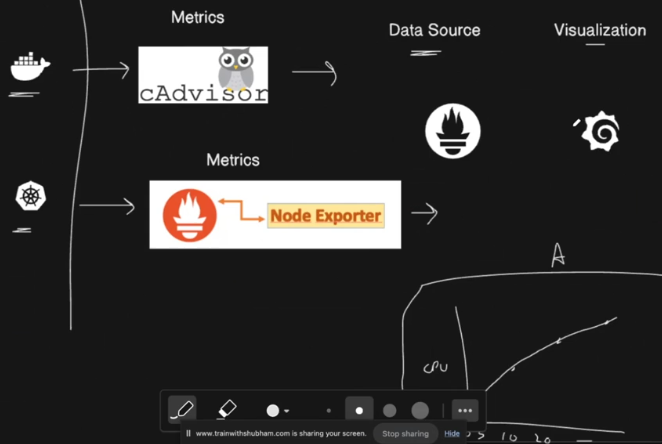
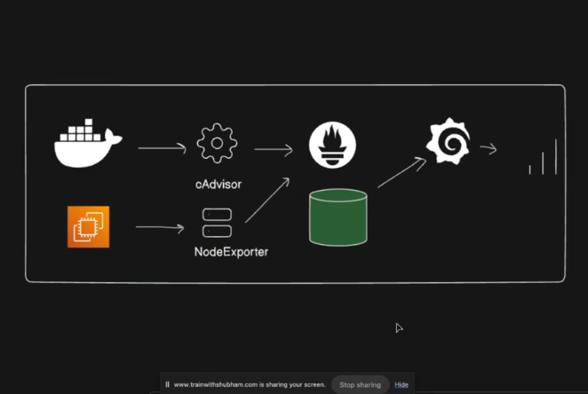
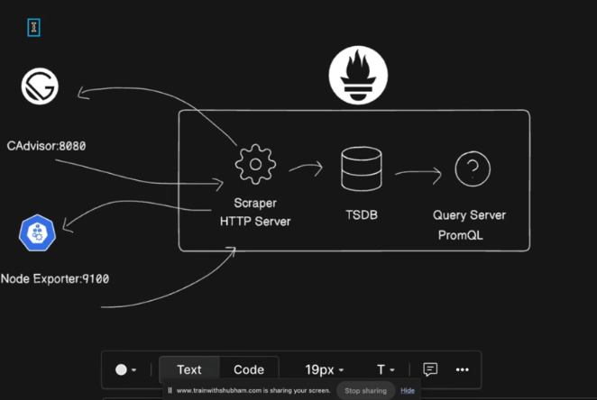

## Prometheus and Grafana


# Dev/DevOps/Test/IT
1. Git
2. Networking
3. Linux + Shell Scripting
4. Docker


# Core DevOps
1. Jenkins
2. Kubernetes
3. Terraform
4. AWS
5. Ansible

# SRE
1. Python
2. Prometheus
3. Grafana
4. SLA/SLO/SLI
5. Nginx


## Observability

1. Logging -> (Loki/Loguru/CloudWatch/Logstash -> ELK - Elastic(db) - Logstash - Kibana)
2. Monitoring -> (Grafana/Kibana/OpenSearch Dashboards/Prometheus)
3. Alerting -> (Mail/Stack/n8n)

4. SLA -> Service Level Agreement
5. SLO -> Service Level Objective -> (if the application goes down then, it should be up in few minutes -> ansible,terraform)
6. SLI -> Service Level Indicators 




## 🔹 Prometheus


### What is Prometheus?

**Prometheus** is an open-source monitoring and alerting system designed to collect, store, and query time-series data (metrics). It is widely used in DevOps and cloud-native environments, especially with Kubernetes.

It was originally developed at SoundCloud and later became a graduated project under the Cloud Native Computing Foundation (CNCF).

---

### Core Concept

Prometheus works on a **pull-based model**:

* It periodically **scrapes metrics** from configured targets.
* Stores them as **time-series data**.
* Allows querying using **PromQL (Prometheus Query Language)**.
* Sends alerts via Alertmanager when conditions are met.

---

### Key Components

1. Prometheus Server

   * Scrapes metrics from targets.
   * Stores metrics in a local time-series database.
   * Evaluates alert rules.

2. Exporters

   * Convert metrics from services into Prometheus format.
   * Example: Node Exporter (for system metrics), MySQL Exporter, etc.

3. Pushgateway

   * Used for short-lived jobs to push metrics.

4. Alertmanager

   * Handles alerts generated by Prometheus.
   * Supports email, Slack, PagerDuty, etc.

---

### Data Model

Prometheus stores data as:

metric_name{label1="value1", label2="value2"} value timestamp

Example:

http_requests_total{method="GET", status="200"} 2450

* Metric name: http_requests_total
* Labels: method, status
* Value: 2450
* Timestamp: when recorded

This label-based model makes it very powerful for filtering and aggregation.

---

### Important Features

1. Multi-dimensional data model (labels)
2. Powerful query language (PromQL)
3. Pull-based architecture
4. Built-in alerting
5. Service discovery (Kubernetes, EC2, etc.)
6. No external dependencies (single binary)

---

### Example Use Case

If you are running Kubernetes:

* Prometheus scrapes:

  * CPU usage
  * Memory usage
  * Pod status
  * API latency

You can then write a query:

avg(rate(http_requests_total[5m]))

to monitor request rate over the last 5 minutes.

---

## 🔹 Grafana


### What is Grafana?

**Grafana** is an open-source visualization and dashboard tool used to display metrics stored in data sources like Prometheus, MySQL, Elasticsearch, and many others.

It does not collect data. It visualizes data.

---

### Core Idea

Prometheus = Data collection + storage
Grafana = Visualization + dashboard

They are commonly used together.

---

### Key Features

1. Beautiful dashboards
2. Multiple data source support
3. Real-time monitoring
4. Alerting support
5. Role-based access control
6. Panel customization (graphs, tables, heatmaps, etc.)

---

### How Grafana Works with Prometheus

1. Prometheus collects and stores metrics.
2. Grafana connects to Prometheus as a data source.
3. Grafana runs PromQL queries.
4. Results are displayed as graphs or panels.

---

### Example Workflow

You deploy:

* Application
* Node Exporter
* Prometheus
* Grafana

Now:

* Prometheus collects CPU, memory, request metrics.
* Grafana shows:

  * CPU usage graph
  * Memory consumption trend
  * HTTP error rate panel
  * Pod restart count

You can build a full production monitoring dashboard.

---

## Prometheus vs Grafana (Clear Difference)

| Feature          | Prometheus        | Grafana                     |
| ---------------- | ----------------- | --------------------------- |
| Role             | Monitoring system | Visualization tool          |
| Stores data      | Yes               | No                          |
| Query language   | PromQL            | Uses PromQL via data source |
| Alerting         | Built-in          | Optional                    |
| Collects metrics | Yes               | No                          |

---

## Why They Are Popular in DevOps

Since you're focusing on DevOps and Kubernetes, this stack is almost mandatory in production environments.

They help with:

* Infrastructure monitoring
* Application monitoring
* SLA tracking
* Alerting before outages
* Performance optimization

---

## Steps


1. Create an EC2 instance (medium/large)
2. sudo apt-get update
3. sudo apt-get install docker.io docker-compose-v2 -y
4. sudo usermod -aG docker $USER && newgrp docker
5. git clone https://github.com/Adarsh097/observability-for-devops.git
6. cd observability-for-devops
7. vim docker-compose.yml
8. docker compose up
9. expose port:8000 -> Notes-app

# cAdvisor -> container data
10. visit the website for image configuration of cAdvisor
11. make sure all are running under same network
12. expose port:8080 -> cadvisor
13. expose port:6379 -> redis

# nodeExporter -> node data
14. setup node-exporter using docker-compose.yml

# prometheus

15. get the config prometheus.yml file

```
wget https://raw.githubusercontent.com/prometheus/prometheus/main/documentation/examples/prometheus.yml

```

16. write the configuration for prometheus in docker-compose.yml
17. epxose the port:9090
18. http://3.110.219.178:9090/metrics

# Attaching cadvisor and node-exporter to prometheus


```
# my global config
global:
  scrape_interval: 15s # Set the scrape interval to every 15 seconds. Default is every 1 minute.
  evaluation_interval: 15s # Evaluate rules every 15 seconds. The default is every 1 minute.
  # scrape_timeout is set to the global default (10s).

# Alertmanager configuration
alerting:
  alertmanagers:
    - static_configs:
        - targets:
          # - alertmanager:9093

# Load rules once and periodically evaluate them according to the global 'evaluation_interval'.
rule_files:
  # - "first_rules.yml"
  # - "second_rules.yml"

# A scrape configuration containing exactly one endpoint to scrape:
# Here it's Prometheus itself.
scrape_configs:
  # The job name is added as a label `job=<job_name>` to any timeseries scraped from this config.
  - job_name: "prometheus"

    # metrics_path defaults to '/metrics'
    # scheme defaults to 'http'.

    static_configs:
      - targets: ["localhost:9090"]
       # The label name is added as a label `label_name=<label_value>` to any timeseries scraped from this config.
        labels:
           app: "prometheus"

  - job_name: "cAdvisor-docker"
    static_configs:
      - targets: ["cadvisor:8080"]

  - job_name: "NodeExporter"
    static_configs:
      - targets: ["node-exporter:9100"]" 

```
19.  docker logs to see the error if occurs


## Connecting Prometheus to Grafana -> visualisation

1.  write the configuration for grafana and expose port:3000
2. On Grafana, Select data source as Prometheus.
3. Create metrics graph by yourself.
4. You can directly make the use of templates to prepare the dashbaoard.


## docker-compose.yml

```
services:
  
  notes-app:
    build:
      context: ./notes-app
    ports:
      - "8000:8000"
    container_name: notes-app
    networks:
      - monitoring
    restart: always

  cadvisor:
    image: gcr.io/cadvisor/cadvisor:latest
    container_name: cadvisor
    ports:
      - "8080:8080"
    volumes:
      - /:/rootfs:ro
      - /var/run:/var/run:rw
      - /sys:/sys:ro
      - /var/lib/docker/:/var/lib/docker:ro
    depends_on:
      - redis
    networks:
      - monitoring

  redis:
    image: redis:latest
    container_name: redis
    ports:
      - "6379:6379"
    networks:
      - monitoring

  node-exporter:
    image: prom/node-exporter:latest
    container_name: node-exporter
    restart: unless-stopped
    volumes:
      - /proc:/host/proc:ro
      - /sys:/host/sys:ro
      - /:/rootfs:ro
    command:
      - '--path.procfs=/host/proc'
      - '--path.rootfs=/rootfs'
      - '--path.sysfs=/host/sys'
      - '--collector.filesystem.mount-points-exclude=^/(sys|proc|dev|host|etc)($$|/)'
    expose:
      - 9100
    ports:
      - "9100:9100"
    networks:
      - monitoring

  prometheus:
    image: prom/prometheus:latest
    container_name: prometheus
    ports:
      - "9090:9090"
    volumes:
      - prometheus_data:/prometheus
      - ./prometheus.yml:/etc/prometheus/prometheus.yml:ro
    networks:
      - monitoring
    restart: unless-stopped

  grafana:
    image: grafana/grafana-enterprise
    container_name: grafana
    ports:
      - "3000:3000"
    volumes:
      - grafana_data:/var/lib/grafana
      - ./data/grafana/provisioning/datasources:/etc/grafana/provisioning/datasources
      - ./data/grafana/provisioning/dashboards:/etc/grafana/provisioning/dashboards
    networks:
      - monitoring
    restart: unless-stopped
volumes:
  prometheus_data: {}
  grafana_data: {}
    
networks:
  monitoring:


```

