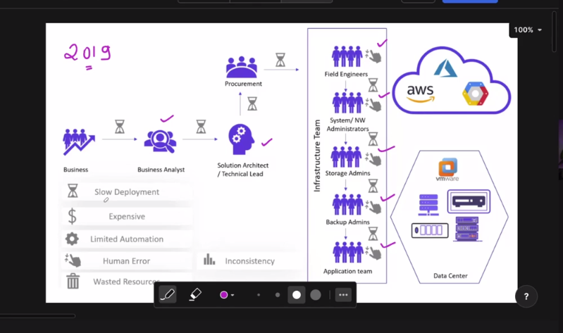
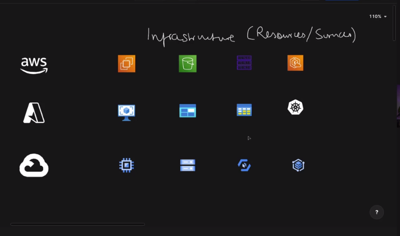
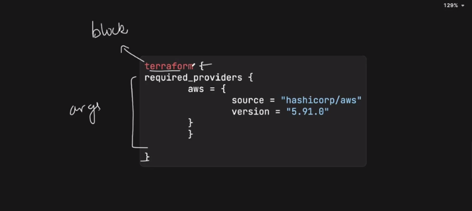

## Terraform

1. Infrastructure As Code Tool.
2. It has been given by the harshicorp organization.
3. It is Business Source Licence Tool i.e. other companies can't use the code of terraform to build their own terraform variant.
4. In 2025, it has been acquired by the IBM. 



5. Here, automation was limited. 
6. So, to automate the infrastructure we use terraform.

# Terrafrom VS Ansible
Great question — this one comes up **all the time** in DevOps interviews and real projects 🙂

At a high level:

> **Terraform = build the infrastructure**
> **Ansible = configure what’s inside that infrastructure**

Let’s break it down cleanly.

---

## 1. Core Purpose

| Aspect      | Terraform                             | Ansible                                    |
| ----------- | ------------------------------------- | ------------------------------------------ |
| Category    | Infrastructure as Code (IaC)          | Configuration Management & Automation      |
| Main Job    | **Provision infrastructure**          | **Configure & manage servers/apps**        |
| Typical Use | Create VMs, VPCs, EKS, Load Balancers | Install packages, set configs, deploy apps |

Example:

* Terraform → create EC2, EKS, RDS
* Ansible → install Docker, Nginx, deploy app on EC2

---

## 2. Approach (How they work)

| Aspect    | Terraform                                      | Ansible                 |
| --------- | ---------------------------------------------- | ----------------------- |
| Model     | **Declarative**                                | Mostly **Procedural**   |
| State     | Maintains **state file** (`terraform.tfstate`) | No state file           |
| Execution | Plans → applies changes                        | Runs tasks step by step |

### Terraform (Declarative)

You say **what you want**, not how:

```hcl
resource "aws_instance" "web" {
  instance_type = "t2.micro"
}
```

### Ansible (Procedural)

You say **how to do it**:

```yaml
- name: Install nginx
  apt:
    name: nginx
    state: present
```

---

## 3. State Management

| Feature         | Terraform              | Ansible         |
| --------------- | ---------------------- | --------------- |
| State tracking  | Yes (very important)   | No              |
| Drift detection | Yes (`terraform plan`) | No (by default) |
| Rollback        | Via state & plan       | Manual          |

Terraform **knows what exists** in infra.
Ansible **assumes servers exist**.

---

## 4. Agent Model

| Aspect       | Terraform              | Ansible     |
| ------------ | ---------------------- | ----------- |
| Agent needed | ❌ No                   | ❌ No        |
| Connection   | API-based (cloud APIs) | SSH / WinRM |
| Target       | Cloud resources        | Servers     |

Both are **agentless**, but:

* Terraform talks to **cloud APIs**
* Ansible talks to **machines**

---

## 5. Idempotency

| Aspect         | Terraform       | Ansible                   |
| -------------- | --------------- | ------------------------- |
| Idempotent     | Yes (by design) | Mostly (module-dependent) |
| Detect changes | Strong          | Limited                   |

Terraform is **strictly idempotent**.
Ansible is **best-effort idempotent**.

---

## 6. Typical Workflow (Real World)

### Common DevOps Flow (Very Important 🔥)

```
Terraform → Ansible → CI/CD
```

Example:

1. Terraform creates:

   * VPC
   * EC2
   * EKS
2. Ansible configures:

   * Docker
   * Kubernetes tools
   * App dependencies
3. CI/CD deploys application

---

## 7. Multi-Cloud Support

| Aspect      | Terraform                   | Ansible             |
| ----------- | --------------------------- | ------------------- |
| Multi-cloud | Excellent                   | Limited             |
| Providers   | AWS, Azure, GCP, Kubernetes | Works via SSH       |
| Best for    | Infra consistency           | OS-level automation |

Terraform shines in **multi-cloud** setups.

---

## 8. When to Use What

### Use **Terraform** when:

* Creating cloud infrastructure
* Managing VPCs, EKS, RDS, IAM
* You need **drift detection**
* Multi-cloud strategy

### Use **Ansible** when:

* Configuring servers
* Installing software
* Managing OS configs
* App deployment on VMs

---

## 9. Interview One-Liner (Gold 🥇)

> **Terraform provisions infrastructure, Ansible configures it.**
> Terraform answers *“what should exist”*, Ansible answers *“how to set it up”*.

---

## 10. Can They Replace Each Other?

❌ **No** — they **complement** each other.

* Terraform is bad at:

  * Package installs
  * App configuration
* Ansible is bad at:

  * Infra lifecycle
  * Cloud resource tracking

---


## Terraform VS CloudFormation(AWS specific using templates)

Nice, this is another **classic interview + real-world DevOps** comparison.
Short version first, then deep dive 👇

> **Terraform = cloud-agnostic, flexible, industry-standard**
> **CloudFormation = AWS-native, tightly integrated, AWS-only**

---

## 1. What they are

| Aspect        | Terraform                    | CloudFormation               |
| ------------- | ---------------------------- | ---------------------------- |
| Type          | Infrastructure as Code (IaC) | Infrastructure as Code (IaC) |
| Owner         | HashiCorp                    | AWS                          |
| Cloud support | **Multi-cloud**              | **AWS only**                 |
| Language      | HCL                          | YAML / JSON                  |

---

## 2. Cloud Support (Biggest Difference)

| Feature     | Terraform | CloudFormation |
| ----------- | --------- | -------------- |
| AWS         | ✅         | ✅              |
| Azure       | ✅         | ❌              |
| GCP         | ✅         | ❌              |
| Kubernetes  | ✅         | ❌              |
| Multi-cloud | ⭐⭐⭐⭐⭐     | ❌              |

👉 If your company **might move clouds** → Terraform wins immediately.

---

## 3. State Management

| Aspect          | Terraform                  | CloudFormation       |
| --------------- | -------------------------- | -------------------- |
| State file      | `terraform.tfstate`        | Managed by AWS       |
| Storage         | S3, local, Terraform Cloud | Automatically in AWS |
| Drift detection | `terraform plan`           | Limited              |
| Manual control  | Full                       | Limited              |

Terraform gives **full visibility & control**.
CloudFormation hides state **inside AWS** (simpler but less flexible).

---

## 4. Language & Readability

### Terraform (HCL – cleaner & shorter)

```hcl
resource "aws_instance" "web" {
  instance_type = "t2.micro"
}
```

### CloudFormation (YAML – verbose)

```yaml
Resources:
  WebInstance:
    Type: AWS::EC2::Instance
    Properties:
      InstanceType: t2.micro
```

👉 Most engineers find **Terraform easier to read & maintain**.

---

## 5. Change Planning & Preview

| Feature                   | Terraform                     | CloudFormation       |
| ------------------------- | ----------------------------- | -------------------- |
| Preview changes           | `terraform plan` (very clear) | Change Sets          |
| Human-readable            | ⭐⭐⭐⭐⭐                         | ⭐⭐⭐                  |
| Detect accidental deletes | Yes                           | Yes (less intuitive) |

Terraform’s **plan output** is a huge productivity win.

---

## 6. Modularity & Reusability

| Feature             | Terraform                 | CloudFormation |
| ------------------- | ------------------------- | -------------- |
| Modules             | Native & powerful         | Nested stacks  |
| Reuse across clouds | Yes                       | No             |
| Community modules   | Huge (Terraform Registry) | Limited        |

Terraform modules are **industry gold standard**.

---

## 7. AWS Integration Depth

| Feature            | Terraform                | CloudFormation |
| ------------------ | ------------------------ | -------------- |
| New AWS services   | Slower (provider update) | **Immediate**  |
| AWS-native tooling | Good                     | **Excellent**  |
| IAM integration    | Good                     | Excellent      |

👉 CloudFormation gets **day-1 AWS service support**.

---

## 8. Error Handling & Rollback

| Aspect          | Terraform      | CloudFormation         |
| --------------- | -------------- | ---------------------- |
| Rollback        | Manual         | **Automatic rollback** |
| Partial failure | Needs handling | Managed by AWS         |
| Safety          | Medium         | High (AWS controlled)  |

CloudFormation is **safer for strict AWS environments**.

---

## 9. Ecosystem & Industry Usage

| Aspect            | Terraform     | CloudFormation       |
| ----------------- | ------------- | -------------------- |
| Industry adoption | **Very high** | Mostly AWS-only orgs |
| DevOps standard   | Yes           | No                   |
| Interview demand  | ⭐⭐⭐⭐⭐         | ⭐⭐⭐                  |

Terraform is asked in **almost every DevOps interview**.

---

## 10. When to Use What (Very Important)

### Use **Terraform** when:

* Multi-cloud or future cloud migration
* Cleaner code & strong community
* You want infra + Kubernetes + SaaS
* Working in **modern DevOps teams**

### Use **CloudFormation** when:

* 100% AWS, no plans to move
* Need **tight AWS integration**
* Strong governance & auto-rollback
* AWS-centric enterprise teams

---

## 11. Can They Be Used Together?

Yes 👍 (rare but possible)

Example:

* CloudFormation → core AWS accounts, IAM baseline
* Terraform → app infrastructure, EKS, microservices

But most teams **standardize on one**.

---

## 12. Interview One-Liner (Must Remember 🥇)

> **Terraform is cloud-agnostic and flexible; CloudFormation is AWS-native and tightly integrated.**
> Choose Terraform for portability, CloudFormation for pure AWS control.

---



## SetUp for the terraform

1. On EC2 server (t3.micro)
```
1. SSH to the node.
2. Use guide for installation of terraform.
3. After installation
4. for terraform-files -> .tf 
5. <block> <parameters> <name>{
    - arguments
}
6. for resource -> resource block
7. for outputes -> output block
8. for variables -> variable block

9. resource/output/variable name -> parameters


```

Alright Adarsh, let’s go **deep but structured** — this is exactly the level expected in **DevOps interviews + real projects**.
I’ll explain **Terraform concepts first**, then **every important command in depth**, with **flow, internals, and interview notes**.

---

# What is Terraform? (Deep Understanding)

**Terraform** is an **Infrastructure as Code (IaC)** tool by **HashiCorp** that lets you **define, provision, update, and destroy infrastructure** using **declarative configuration files**.

👉 You describe **what infrastructure should exist**, Terraform figures out **how to create/update/delete it**.

---

## Why Terraform Exists (Core Problem It Solves)

Before Terraform:

* Manual cloud creation (click-ops)
* Scripts that were hard to maintain
* No idea what infra currently exists
* No drift detection

Terraform solves:

* **Repeatability**
* **Version control**
* **Drift detection**
* **Multi-cloud consistency**

---

# Core Terraform Architecture (Very Important)

Terraform works using **4 core components**:

1. **Configuration files** (`.tf`)
2. **Providers**
3. **State**
4. **Execution engine**

---

## 1. Terraform Configuration Files

### File Types

| File               | Purpose         |
| ------------------ | --------------- |
| `main.tf`          | Resources       |
| `variables.tf`     | Input variables |
| `outputs.tf`       | Output values   |
| `terraform.tfvars` | Variable values |

Terraform loads **all `.tf` files together** (order doesn’t matter).

---

## 2. Providers (How Terraform Talks to Cloud)

Providers are **plugins** that let Terraform interact with APIs.

Examples:

* AWS
* Azure
* GCP
* Kubernetes
* GitHub

```hcl
provider "aws" {
  region = "ap-south-1"
}
```

👉 Terraform **does not create infra directly** — providers do.

---

## 3. State File (terraform.tfstate)

This is **Terraform’s brain** 🧠

State file stores:

* What resources exist
* Their IDs
* Dependencies
* Metadata

Why state is critical:

* Detects changes
* Prevents duplicates
* Enables `plan`

Best practice:

```hcl
backend "s3" {
  bucket = "terraform-state"
  key    = "prod/terraform.tfstate"
  region = "ap-south-1"
}
```

---

## 4. Execution Lifecycle

Terraform always follows:

```
init → plan → apply → manage → destroy
```

---

# Terraform Commands (IN DEPTH)

Now the main part 👇

---

## 1. `terraform init`

### What it does

* Initializes working directory
* Downloads providers
* Configures backend
* Prepares modules

### When to run

* First time in project
* After adding provider
* After changing backend
* After adding modules

### Internals

Creates:

* `.terraform/` directory
* `.terraform.lock.hcl`

### Command

```bash
terraform init
```

### Interview Tip

> `terraform init` does **NOT** create infrastructure.

---

## 2. `terraform validate`

### What it does

* Syntax check
* Configuration sanity check

### What it does NOT do

* Does not check cloud credentials
* Does not check resource existence

```bash
terraform validate
```

---

## 3. `terraform fmt`

### What it does

* Formats `.tf` files
* Enforces standard style

```bash
terraform fmt
```

CI/CD best practice: **always run fmt**.

---

## 4. `terraform plan` (MOST IMPORTANT)

### What it does

* Compares:

  * Desired state (code)
  * Current state (tfstate)
* Shows **execution plan**

### Output types

* `+` create
* `~` update
* `-` destroy

```bash
terraform plan
```

### Save plan

```bash
terraform plan -out=tfplan
```

Why saving plan matters:

* Ensures same changes are applied
* Used in CI/CD approval flow

---

## 5. `terraform apply`

### What it does

* Executes the plan
* Creates/updates/destroys infra

```bash
terraform apply
```

Apply saved plan:

```bash
terraform apply tfplan
```

Terraform:

* Resolves dependencies
* Executes in parallel
* Updates state file

---

## 6. `terraform destroy`

### What it does

* Deletes **all managed resources**

```bash
terraform destroy
```

Destroy specific resource:

```bash
terraform destroy -target=aws_instance.web
```

⚠️ Dangerous in prod — protect with approvals.

---

## 7. `terraform show`

### What it does

* Displays current state

```bash
terraform show
```

For JSON:

```bash
terraform show -json
```

Used by automation tools.

---

## 8. `terraform state` (Advanced)

Used to **manipulate state manually**.

### Common subcommands

#### List resources

```bash
terraform state list
```

#### Show resource

```bash
terraform state show aws_instance.web
```

#### Remove resource (without deleting infra)

```bash
terraform state rm aws_instance.web
```

Use case:

* Resource created manually
* State corruption
* Refactoring

---

## 9. `terraform import`

### What it does

* Brings **existing infra** under Terraform control

```bash
terraform import aws_instance.web i-123456
```

Important:

* Does NOT generate code
* Only updates state

---

## 10. `terraform refresh` (Deprecated-ish)

* Syncs state with real infra
* Now handled automatically by `plan`

---

## 11. `terraform output`

### What it does

* Displays output variables

```bash
terraform output
```

Specific output:

```bash
terraform output instance_ip
```

---

## 12. `terraform workspace`

Used for **multiple environments**.

```bash
terraform workspace new dev
terraform workspace select prod
terraform workspace list
```

👉 Separate state per workspace.

---

# Terraform Dependency Management

Terraform builds a **dependency graph** automatically.

Example:

```hcl
resource "aws_instance" "web" {
  subnet_id = aws_subnet.main.id
}
```

Order is **implicit**, no need to define manually.

---

# Terraform Best Practices (Interview Gold)

* Remote backend (S3 + DynamoDB)
* Use modules
* One repo per service
* Lock state
* Never edit state manually
* Use `plan -out` in CI/CD

---

# Terraform vs Ansible (One Line Recap)

> Terraform creates infrastructure; Ansible configures it.

---

# Real-World Example (Simple Flow)

```
terraform init
terraform fmt
terraform validate
terraform plan -out=tfplan
terraform apply tfplan
```

---


## Hands On Terraform
1. terraform --version
2. touch main.tf
3. main.tf -> initialise (terraform init) -> format (terraform fmt) -> validate (terraform validate) -> plan and dry run (terraform plan) -> apply (terraform apply) -> destroy (terraform destroy)

4. terraform apply -auto-approve
5. terraform destroy -auto-approve

6. providers -> local, aws, azure, gcp, etc.


7. Connect to your account
8. Install aws cli from documentation.
9. aws --version
10. aws configure
11. Go to IAM on aws
12. Create new user -> go to security credentials of user -> create an access key -> now provide keys to configure the user.

```
1. Access key ID
2. Secret Access Key
3. Region Name
4. Output format

```
13. aws s3 ls -> to see the s3 buckets on aws
14. ready to apply the resources.
15. S3 bucket name shoulde be unique
16. terraform state list -> to see all the resources


# Creating ec2 instance
1. generate key-pair -> ssh-keygen
2. follow the file
3. ssh -i <private-key-name.pem> ubuntu@<public-dns-output>
4. terraform output -> to see the output variables


## Quiz
1.  HCL language is used to configure the resources in human readable format.
2. terraform init -> to initialize the terraform in working directory
3. terraform plan -> to create an execution plan
4. plan.out -> default file created by Terraform to store the execution plan
5. .terraform directory -> contains provider pluggin and metadata
6. terraform destroy -> to delete the infrastructure
7. main.tf -> stores the resource configurations
8. --target -> to point the specific resource.