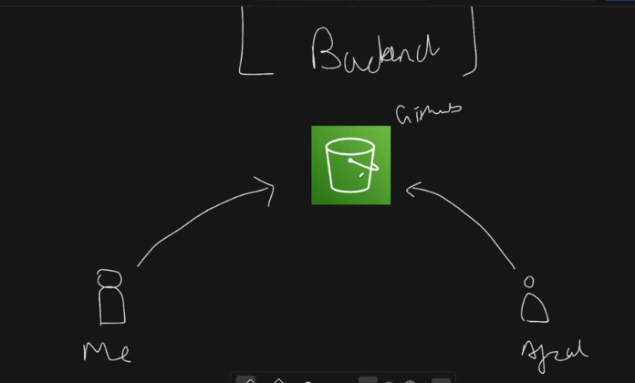
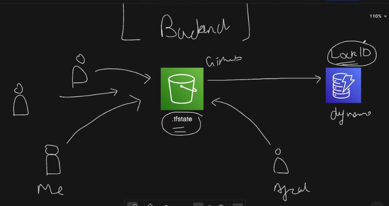

## Terraform Part-2

1. count = 2 -> is a meta argument used to define the number of instances that should be provisioned.

2. SPOT (Bidding based instances) | ON DEMAND (fixed price)

3. for_each (meta argument)
```
for_each = tomap({
    "TWS-Junoon-automate-micro" = "t3.micro",
    "TWS-Junoon-automate-small" = "t3.small"
})

each.key | each.value


output "ec2_public_ip" {
  value = [
    for instance in aws_instance.ec2-myInstance-1 : instance.public_ip
  ]
}

```

4. depends_on -> tells the dependency of one resource on the another

```
depends_on      = [aws_security_group.my_security_group]

```

# Conditional Statement
5. Let if the environment is productino then, storage volume should be 20GB and if it is development then, storeage volume should be 10GB.

```
variable "env" {
    default = "prod"
    type = string
}

  root_block_device {
    volume_size = var.env == "prod" ? 20 : var.aws_root_storage_size_default
    volume_type = "gp3"
  }


```

# Terraform State Management & Backend
1. terraform refresh -> to refresh the state file as per the infrastructure provisioned.
2. terraform apply -> default refreshing.

```
terraform state -h -> help

terraform state list -> list the provisioned resources.

terraform state show <particular resource>

terraform state rm <particular resource> -> we don't want to manage the state | resource will be present in cloud but removed from state-file


terraform import aws_key_pair.my_key key-name -> to pull the state from cloud to state file -> terraform apply


```

3. automating the manually created ec2 from terraform
```
resource "aws_instance" "my_new_instance" {
    ami = "unknown"
    instance_type = "unknown"


}

terraform import aws_instance.my_new_instance <instance_id of manully created node>


```

4. .tfstate file -> should not be commited to github -> problem-1
5. .tfstate file if gets deleted -> protect it
6. We need to avoid the <state-conflict> if multiple persons are managing the infra. -> problem-2
7. SOLUTION -> Make a common state-file and store it in a remote secured location like S3-bucket on AWS.(Remote Backend)



8. State Locking -> to avoid multiple person to change the state file -> Lock and Release Mechanism (If one person is accessing the state -> lock-id is generated and get stored in Dyanamo DB(key-value) -> other person will be able to use the state if the lock is removed).



9. billing_mode = PAY_PER_REQUEST | PROVISIONED -> PAY_PER_REQUEST is better for cost optimisation.

- BACKUP OF STATE FILE
10. If the state file gets deleted then, rename the backup-state-file as state-file

11. If we also delete the .tfstate.backup -> solution-> remote backend

```
terraform {
  required_providers {
    aws = {
      source  = "hashicorp/aws"
      version = "6.30.0"
    }
  }

  # to manage remote state in s3
  backend "s3" {
    bucket = "my-unique-remote-terraform-state-bucket-5559-ad"
    key    = "terraform.tfstate"
    region = "ap-south-1"
    # state locking with dynamodb
    dynamodb_table = "state-lock-table-5559-ad"
  }
}

```
12. terraform init -> after changing the terraform block
13. Now, if you delete the .tfstate and .tfstate.backup -> then, also state is saved -> terraform state list
14. If now multiple user try to change the state and apply the state in terraform will be restricted due to state locking.

15. If the lock is deleted then, only the second user can access the state file.

- REMOTE BACKEND IS IMPORTANT CONCEPT
